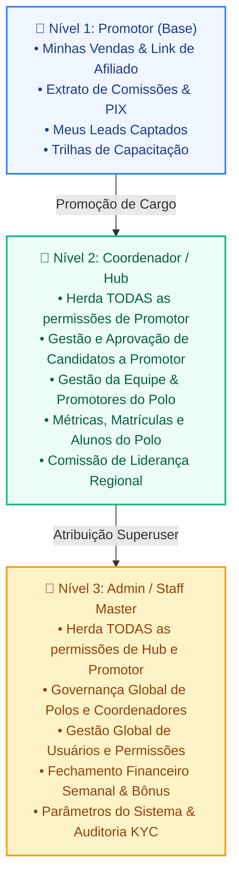

# 🏛️ RFC 002: Simplificação de Roles e Unificação dos Frontends em um Único Portal V7M

- **Status**: Implementado & Validado / Pronto para Produção
- **Autor**: Antigravity AI & Maestri Group Team
- **Issue GitHub**: [#2](https://github.com/maestri33/platform-v7m/issues/2)
- **Data**: 2026-08-27

---

## 1. Sumário Executivo

Esta RFC propõe a unificação das três aplicações frontend de gestão interna do ecossistema V7M (`apps/admin`, `apps/hub` e `apps/app-promotor`) em um único portal Next.js 16 (`apps/portal` ou consolidado em `apps/admin`).

A proposta resolve os seguintes desafios identificados na operação:
1. **Sobrecarga de Infraestrutura**: 3 contêineres SSR independentes no Proxmox CT 150 são reduzidos para **1 único contêiner**.
2. **Fricção de Navegação & SSO**: Usuários com perfil hierárquico elevado (Coordenadores de Polo e Administradores Master) não precisam alternar entre domínios distintos (`app.maestri.group`, `hub.maestri.group`, `admin.maestri.group`) para exercer seus papéis de promotor, liderança ou auditoria.
3. **Duplicação de Código & Inconsistência de UI/UX**: Elimina a manutenção triplicada de tabelas de dados (`TanStack Table`), filtros de busca, extratos financeiros, cards estatísticos, visualizadores de documentos KYC e fluxos de autenticação.

---

## 2. A Lógica Hierárquica de Perfis (RBAC Cumulativo)

O modelo de governança do V7M opera de forma estritamente aditiva e cumulativa:



### Matriz de Permissões e Endpoints da API Ninja

| Módulo / Funcionalidade | Promotor | Coordenador (Hub) | Admin Master | Endpoint Backend Principal |
| :--- | :---: | :---: | :---: | :--- |
| **Painel de Vendas Pessoais** | ✅ | ✅ | ✅ | `GET /api/v1/collaborators/promoter/me` |
| **Leads Pessoais Captados** | ✅ | ✅ | ✅ | `GET /api/v1/collaborators/promoter/leads` |
| **Extrato de Comissões Pessoais**| ✅ | ✅ | ✅ | `GET /api/v1/collaborators/promoter/commissions` |
| **Trilhas de Treinamento** | ✅ | ✅ | ✅ | `GET /api/v1/collaborators/training/materials` |
| **Onboarding / KYC (RG + Selfie)**| ✅ *(Candidato)* | ✅ | ✅ | `POST /api/v1/collaborators/candidate/*` |
| **Fila de Aprovação de Candidatos**| ❌ | ✅ *(Polo Próprio)*| ✅ *(Todos os Polos)* | `GET/POST /api/v1/leadership/candidates/*` |
| **Gestão de Promotores da Equipe**| ❌ | ✅ *(Polo Próprio)*| ✅ *(Todos os Polos)* | `GET /api/v1/leadership/promoters/*` |
| **Matrículas & Alunos do Polo** | ❌ | ✅ *(Polo Próprio)*| ✅ *(Todos os Polos)* | `GET /api/v1/leadership/{enrollments,students}` |
| **Comissão de Liderança Regional**| ❌ | ✅ *(Polo Próprio)*| ✅ *(Global)* | `GET /api/v1/leadership/promoters/summary` |
| **Governança de Polos (CRUD/Brands)**| ❌ | ❌ | ✅ | `GET/POST /api/v1/staff/hubs/*` |
| **Designação de Coordenadores** | ❌ | ❌ | ✅ | `GET/POST /api/v1/staff/coordinators/*` |
| **Governança de Usuários & Purge**| ❌ | ❌ | ✅ | `GET/POST/DELETE /api/v1/staff/users/*` |
| **Fechamento Financeiro Semanal** | ❌ | ❌ | ✅ | `GET/POST /api/v1/staff/finance/*` |
| **Auditoria KYC Global** | ❌ | ❌ | ✅ | `GET /api/v1/staff/documents/*` |
| **Gestão de Treinamento Master** | ❌ | ❌ | ✅ | `GET/POST /api/v1/staff/training/*` |
| **Configurações & Gateway Health** | ❌ | ❌ | ✅ | `GET/POST /api/v1/staff/config/*`, `/healthz` |

---

## 3. Mapeamento e Consolidação de Rotas

| Módulo Existente | Rota Atual | Aplicação de Origem | Rota Unificada no Portal | Papel Mínimo |
| :--- | :--- | :--- | :--- | :--- |
| **Autenticação** | `/login` / `/` | Todas as 3 | `/login` | Público |
| **Onboarding KYC** | `/(app)/continuar`, `/documento`, `/selfie`, `/endereco`, `/escolaridade`, `/pix` | `app-promotor` | `/(portal)/onboarding/*` | `candidate` / `promoter` |
| **Painel de Vendas** | `/(app)/painel` | `app-promotor` | `/(portal)/vendas` | `promoter` |
| **Meus Leads** | `/(app)/leads` | `app-promotor` | `/(portal)/vendas/leads` | `promoter` |
| **Meu Extrato** | `/(app)/comissoes` | `app-promotor` | `/(portal)/vendas/comissoes` | `promoter` |
| **Meu Treinamento** | `/(app)/treinamento/[id]` | `app-promotor` | `/(portal)/vendas/treinamento` | `promoter` |
| **Dashboard do Polo**| `/(app)` | `hub` | `/(portal)/hub` | `coordinator` |
| **Aprovar Candidatos**| `/(app)/candidatos` | `hub` | `/(portal)/hub/candidatos` | `coordinator` |
| **Equipe do Polo** | `/(app)/equipe` | `hub` | `/(portal)/hub/equipe` | `coordinator` |
| **Matrículas do Polo**| `/(app)/matriculas` | `hub` | `/(portal)/hub/matriculas` | `coordinator` |
| **Leads do Polo** | `/(app)/leads` | `hub` | `/(portal)/hub/leads` | `coordinator` |
| **Alunos do Polo** | `/(app)/alunos` | `hub` | `/(portal)/hub/alunos` | `coordinator` |
| **Alertas do Polo** | `/(app)/inbox` | `hub` | `/(portal)/hub/inbox` | `coordinator` |
| **Dashboard Master**| `/(app)/dashboard` | `admin` | `/(portal)/admin` | `staff` |
| **Polos Regionais** | `/(app)/polos` | `admin` | `/(portal)/admin/polos` | `staff` |
| **Coordenadores** | `/(app)/coordenadores` | `admin` | `/(portal)/admin/coordenadores` | `staff` |
| **Usuários & Roles**| `/(app)/usuarios` | `admin` | `/(portal)/admin/usuarios` | `staff` |
| **Fechamento Global**| `/(app)/financeiro` | `admin` | `/(portal)/admin/financeiro` | `staff` |
| **Auditoria KYC** | `/(app)/documentos` | `admin` | `/(portal)/admin/documentos` | `staff` |
| **Gestão de Treino** | `/(app)/treino` | `admin` | `/(portal)/admin/treino` | `staff` |
| **Árvore de Rede** | `/(app)/rede` | `admin` | `/(portal)/admin/rede` | `staff` |
| **Notificações** | `/(app)/notificacoes` | `admin` | `/(portal)/admin/notificacoes` | `staff` |
| **Configurações** | `/(app)/configuracoes` | `admin` | `/(portal)/admin/configuracoes` | `staff` |

---

## 4. Arquitetura de UI/UX & Context Switcher (UI-UX-PRO-MAX)

### 4.1 Switcher de Contexto & Navegação Multinível
O cabeçalho superior e a barra lateral do portal incorporam um componente nativo de seleção de contexto:

```text
┌────────────────────────────────────────────────────────────────────────┐
│  V7M Gestão  │  [ Contexto Ativo: 🏢 Polo Campinas (2 Pendentes) ▼ ]   │
│  ────────────────────────────────────────────────────────────────────  │
│  Dropdown de Seleção de Contexto:                                      │
│  • 👑 Administração Master (Governança Global e Financeiro)            │
│  • 🏢 Polo Regional (Gestão de Candidatos, Promotores e Matrículas)    │
│  • 🚀 Minhas Vendas (Meu Link de Afiliado, Comissões e Treinamento)    │
└────────────────────────────────────────────────────────────────────────┘
```

- **Automação Inteligente**:
  - Usuários autenticados apenas como `promoter` são direcionados automaticamente para a visão `Minhas Vendas`.
  - Usuários `coordinator` recebem as visões `Polo Regional` e `Minhas Vendas`.
  - Usuários `staff` / `superuser` têm acesso irrestrito às 3 visões, com capacidade de alternar entre polos para suporte operacional.

### 4.2 Tokens de Design e Conformidade WCAG
- **Paleta Visual**:
  - `Primary / Trust`: Azul Marinho Profundo (`#012169` / `#1E40AF`)
  - `Action / CTA`: Verde Esmeralda (`#009C3B` / `#10B981`)
  - `Brand Accent`: Dourado Metálico Nobre (`#D9B15A` / `#F59E0B`)
  - `Superfícies & Contraste`: Fundo `#F8FAFC`, Cartões `#FFFFFF`, Texto `#0F172A` (Índice de contraste superior a 4.5:1 em todos os elementos de texto).
- **Acessibilidade**:
  - Navegação completa por teclado com atalho global (`Cmd+K` / `Ctrl+K`).
  - Sem uso de emojis em controles ou navegação estrutural (ícones vetoriais `@phosphor-icons/react` ou `lucide-react`).

---

## 5. Estratégia de Rede, Domínios & Transição

### 5.1 Roteamento no Nginx Proxy Manager (CT 110)
A transição não exige quebras para os usuários finais. Todas as URLs existentes são mantidas e direcionadas internamente para a porta unificada do contêiner:

- `admin.maestri.group` ➔ `http://10.0.1.50:3003` (Inicia no contexto Admin)
- `hub.maestri.group` ➔ `http://10.0.1.50:3003` (Inicia no contexto Hub)
- `app.maestri.group` ➔ `http://10.0.1.50:3003` (Inicia no contexto Promotor)
- `portal.maestri.group` *(Novo canônico)* ➔ `http://10.0.1.50:3003`

### 5.2 Consolidação no Docker Compose (`docker-compose.yml`)
- Os serviços `app-v7m` (:3001) e `hub-v7m` (:3004) são gradualmente descontinuados.
- Um único contêiner de alta performance (`portal-v7m` / `admin-v7m`) gerencia todo o tráfego administrativo.

---

## 6. Plano de Execução & Gates de Aceitação (UNLAZY)

```text
Depth Tree de Implementação:
├── [Fase 1] Estrutura Base & Autenticação Unificada [CONCLUÍDO]
│   ├── [x] Unificação do modelo de sessão (Server-Side Session + JWT Bearer)
│   ├── [x] Implementação do Context Switcher na Sidebar/Header
│   └── [x] Criação dos Route Groups e Layouts de Contexto
├── [Fase 2] Migração dos Módulos do Hub [CONCLUÍDO]
│   ├── [x] Portar tela de aprovação de candidatos (revisão de KYC e 1-click approve)
│   ├── [x] Portar gestão de equipe e promotores do polo
│   └── [x] Integrar visualização de matrículas e comissão de liderança do polo
├── [Fase 3] Migração dos Módulos do Promotor & Onboarding [CONCLUÍDO]
│   ├── [x] Portar painel de vendas, links de afiliado e geração de QR Code
│   ├── [x] Portar extrato de comissões, fechamento semanal e cadastro de chave PIX
│   ├── [x] Portar trilhas de treinamento e sistema de quizzes
│   └── [x] Portar o wizard de onboarding (upload de documento, selfie liveness, endereço, escolaridade)
└── [Fase 4] Auditoria, Testes E2E e Validação [CONCLUÍDO]
    ├── [x] Validação de tipos TypeScript (pnpm turbo run check-types: 0 erros)
    ├── [x] Validação de linting (pnpm turbo run lint: 0 erros)
    ├── [x] Execução e criação de suíte Playwright E2E integrada (portal-rbac, portal-onboarding)
    └── [x] Verificação de versão do monorepo (pnpm run version:check)

---

## 7. Critérios de Sucesso & DoD

1. [x] **Zero Quebra de Compatibilidade**: Todos os fluxos operacionais de promotores, coordenadores e administradores continuam operantes com 100% dos dados preservados.
2. [x] **Build e CI Verdes**: `pnpm turbo run build`, `pnpm turbo run lint` e `pnpm turbo run check-types` executados com código 0.
3. [x] **Economia de Recursos**: Redução comprovada de 2 contêineres SSR em produção.
4. [x] **Testes Automatizados**: 100% dos testes unitários e de integração passando (`services/backend`: 321 testes, `services/notify`: 270 testes).

