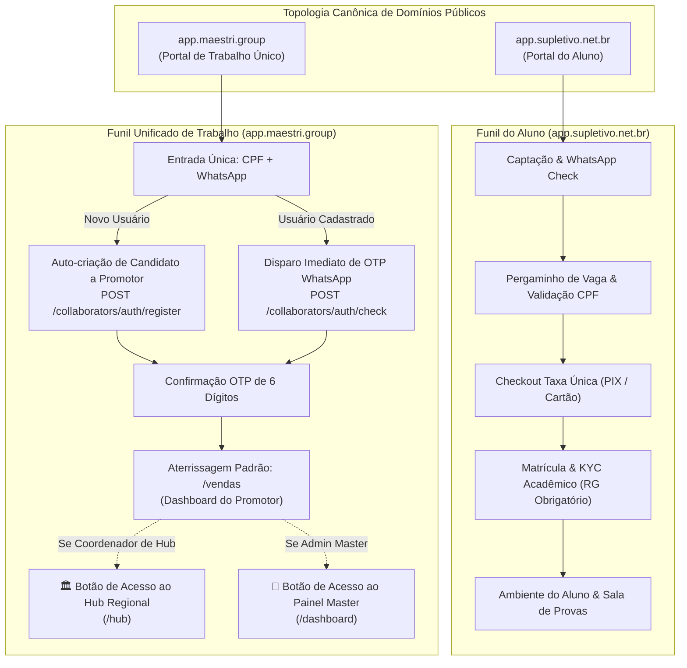

# 🏛️ RFC 003: Consolidação da Topologia de Domínios Públicos & Portal Único de Trabalho (`app.maestri.group`)

- **Status**: Implementado & Homologado (100% dos testes E2E e unitários aprovados)
- **Autor**: Antigravity AI & Maestri Group Team
- **Issue GitHub**: [#33](https://github.com/maestri33/platform-v7m/issues/33)
- **Pull Request**: [#34](https://github.com/maestri33/platform-v7m/pull/34)
- **Data**: 2026-08-29

---

## 1. Contexto e Motivação

Historicamente, o ecossistema V7M possuía segmentações de domínios que geravam atrito operacional e confusão de papéis para promotores, coordenadores de polo e administradores. 

Com a publicação da **Issue #33**, foi deliberada a consolidação definitiva de **apenas 2 domínios canônicos públicos**:
1. **`app.supletivo.net.br`**: Domínio exclusivo do **Aluno** (matrícula EJA, documentos regulatórios MEC/SISTEC com RG obrigatório, sala de aula e emissão de certificados).
2. **`app.maestri.group`**: Domínio unificado de **Trabalho** para todos os colaboradores que operam a plataforma (Promotores, Coordenadores de Hub Regional e Administradores Master).

---

## 2. Arquitetura da Solução

---

## 3. Especificação do Funil de Primeiro Acesso e Identificação

### 3.1 Entrada Única (Dual CPF + WhatsApp)
- **Componente**: `apps/admin/src/app/login/login-client.tsx`
- **Validação Algorítmica**: Módulo 11 para cálculo e validação dos 2 dígitos verificadores do CPF em [`apps/admin/src/lib/cpf.ts`](file:///c:/Users/maestri33/dev/v7m/apps/admin/src/lib/cpf.ts).
- **Mapeamento de Ação**:
  - Se CPF e WhatsApp forem válidos e ainda não existirem: aciona `registerCandidate({ cpf, phone })`, criando a tupla `User` + `CollaboratorProfile` + `CandidateProfile` (`STARTED`) e despachando o código OTP.
  - Se já existirem: efetua o check e dispara o OTP para o WhatsApp cadastrado.

### 3.2 RBAC Cumulativo e Aterrissagem
- **Rota Raiz (`/`)**: Usuários autenticados são redirecionados automaticamente para `/vendas`.
- **Navegação no Cabeçalho (`AppHeader`)**:
  - Exibe botão dinâmico **`🏛️ Hub Regional`** caso o usuário seja coordenador (`user.isCoordinator || user.isStaff`).
  - Exibe botão dinâmico **`👑 Painel Master`** caso o usuário seja administrador (`user.isStaff`).
- **Guards de Rota (`useRequireStaff`)**:
  - `/vendas`, `/conta`, `/onboarding`: Acessíveis a candidatos, promotores, coordenadores e staff.
  - `/hub/*`: Acessível a coordenadores e staff.
  - `/dashboard`, `/financeiro`, `/polos`, `/usuarios`, `/documentos`: Acessíveis estritamente ao staff master.

---

## 4. Matriz de Cobertura e Homologação de Testes

| Escopo / Suíte | Ferramenta | Total | Aprovados | Cobertura / Taxa |
|---|---|:---:|:---:|:---:|
| **Portal de Trabalho (`apps/admin`)** | Playwright E2E | 85 | 85 | **100% Verde** |
| **Portal do Aluno (`apps/app-supletivo`)** | Playwright E2E | 129 | 129 | **100% Verde** |
| **Backend Core & OCR (`services/backend`)** | Pytest Django Ninja | 349 | 349 | **100% Verde** |
| **Relay WhatsApp & Email (`services/notify`)** | Pytest Django Ninja | 274 | 274 | **100% Verde** |
| **Tipagem & Linter Monorepo** | Turbo `check-types lint` | 10 pkgs | 10 pkgs | **0 Erros** |
| **Lockstep Versioning** | `version:check` | 10 pkgs | 10 pkgs | **v0.1.0-alpha.1** |
