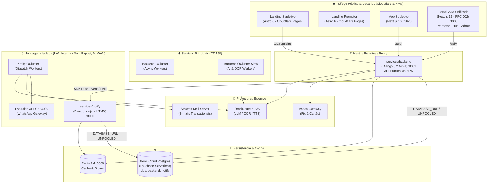

# 🏛️ V7M Architecture & System Design

Este documento reflete a arquitetura real do ecossistema V7M, extraída diretamente do código-fonte e das conexões de rede em tempo de execução.

---

## 🗺️ Mapa de Fluxo de Dados

---

## 🔒 Modelo de Segurança & Isolamento de Redes

1. **Eliminação de CORS & Mixed-Content**:
   - Os navegadores dos usuários comunicam-se estritamente com as portas das aplicações Next.js (`/api/*` e `/media/*`).
   - O Next.js atua como proxy reverso interno apontando para o upstream `backend-web:8000`.
   - Nenhuma chave secreta (`SECRET_KEY`, `ASAAS_API_KEY`, `NOTIFY_API_KEY`) é exposta ao client.

2. **Isolamento Rígido de Mensageria (Zero Exposição Pública)**:
   - **Notify Server (`services/notify` :8000)** e **Evolution GO (`evoapicloud` :4000)** são estritamente isolados na rede interna LAN Proxmox (`10.0.1.0/24`) e bridge Docker `v7m_network`.
   - Nenhum tráfego externo ou regra de Nginx Proxy Manager direciona requisições da WAN para essas portas. Toda interação de mensageria é consumida internamente pelo backend ou acessada via VPN/Tailscale para gestão técnica.

2. **Isolamento de Bancos de Dados & Neon Cloud Serverless**:
   - A persistência é desacoplada da infraestrutura local de computação e operada no **Neon Cloud Postgres**:
     - `backend`: Usuários, leads, candidatos, matrículas, pagamentos, polos e auditoria.
     - `notify`: Contas, instâncias, templates de canal, disparos, logs de envio e supressões.
     - `evogo_auth` / `evogo_users`: Sessões de autenticação do Evolution Go.
   - Ambas as aplicações Django utilizam conexões segregadas: **Pooled** (via PgBouncer em `DATABASE_URL`) para tráfego transacional e **Unpooled / Direct** (`DATABASE_URL_UNPOOLED`) para migrações DDL.

3. **Validação de Documentos & KYC com IA**:
   - O upload de RG é classificado e extraído no backend via OCR assíncrono.
   - A selfie passa por verificação de vivacidade (liveness check) e comparação facial com o documento enviado.
   - Qualquer pendência bloqueia o funil e aciona notificação para o gestor do polo ou coordenador.

---

## 📦 Pacotes Compartilhados (`packages/`)

- **`@v7m/api-client`**:
  - Tipagem TypeScript estrita e cliente `openapi-fetch` gerado automaticamente a partir das rotas da API Django Ninja (`pnpm --filter @v7m/api-client codegen`).
- **`@v7m/ui`**:
  - Biblioteca compartilhada de componentes (botões, cards, formulários, modais, câmera de captura de selfie/documento) e sistema de temas CSS por tokens.
- **`@v7m/tsconfig`**:
  - Configurações base de TypeScript reutilizáveis (`base.json`, `nextjs.json`, `react.json`, `node.json`).
- **`@v7m/eslint-config`**:
  - Regras compartilhadas de ESLint v9.
