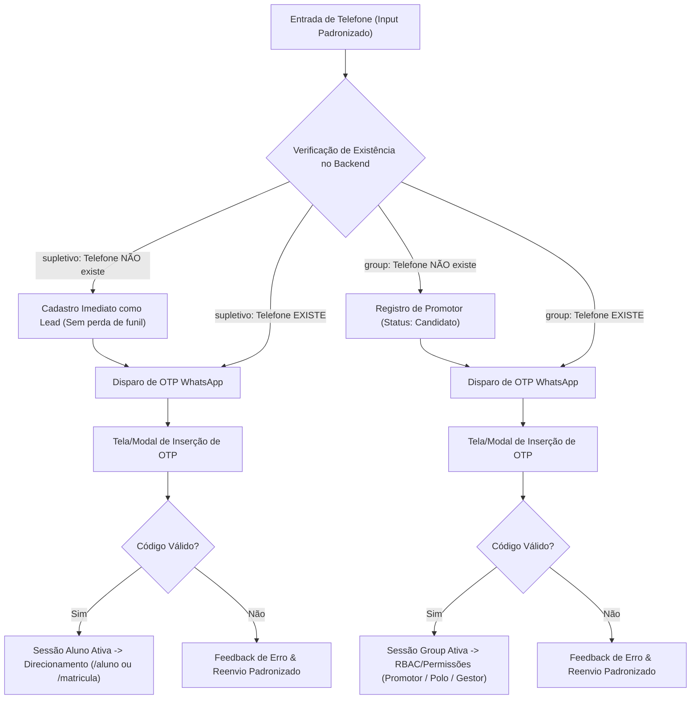
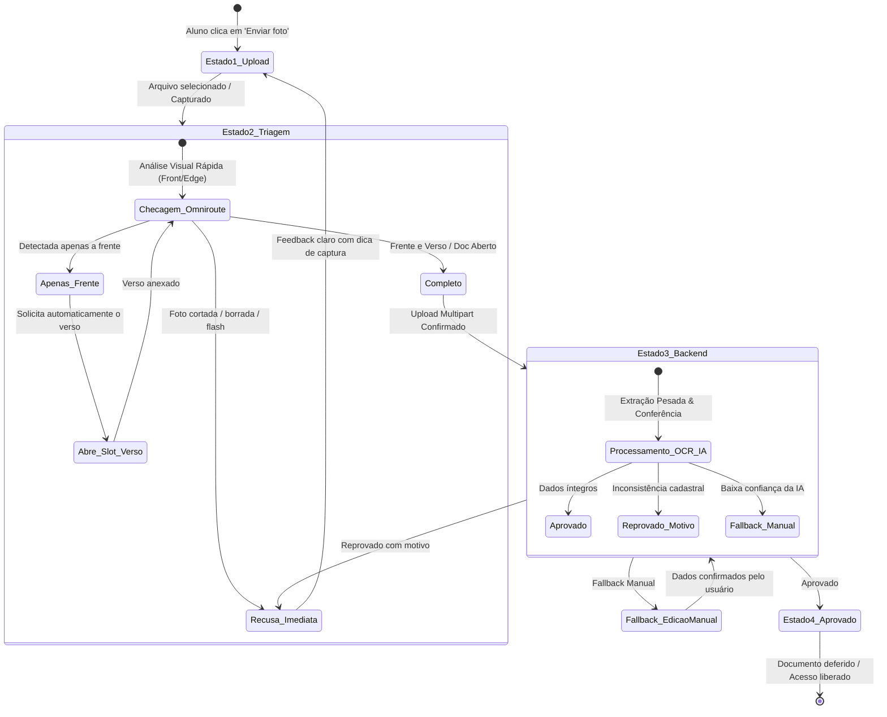

# 📐 Especificação de Design & Arquitetura de UI — V7M (`design.md`)

Este documento consolida a arquitetura visual, o design system compartilhado, o fluxo canônico de autenticação/onboarding e o componente inteligente de upload de documentos (IA First) para o monorepo **V7M**, tomando como base as melhores práticas observadas no aplicativo do Aluno (`apps/supletivo`).

---

## 🏛️ Visão Geral e Princípios Fundamentais

1. **Componentes Prontos, Genéricos e Reutilizáveis (`@v7m/ui`)**:
   - Primitivos visuais baseados em **shadcn/ui**, **Radix UI** e **Tailwind CSS v4**.
   - Toda UI atômica (botões, inputs, cards, dialogs, banners, badges) reside em `packages/ui` e é consumida por todos os apps do monorepo (`apps/supletivo`, `apps/group`, e landings).
2. **Blindagem Anti-Delírio & Simplificação Radical (Ponytail)**:
   - Eliminação de componentes fantasmas, stubs fictícios, CSS inline mastodôntico e lógicas de estado redundantes geradas por IA.
   - Preservação estrita dos contratos reais de API com o backend Django Ninja (`@v7m/api-client`).
3. **Experiência Mobile-First com Foco no Usuário**:
   - Microcópia acolhedora e direta (sem jargões jurídicos ou técnicos).
   - Steppers claros, feedbacks de progresso imediatos e fallbacks transparentes.

---

## 📦 Fase 1: Arquitetura, Monorepo & UI Compartilhada

### 1.1. Padronização do Design System (`packages/ui`)

Os componentes visuais oficiais são padronizados e unificados:

- **Componentes Oficiais de Base**:
  - `Button` (`packages/ui/src/primitives/button.tsx`): Variantes `primary`, `secondary`, `outline`, `ghost`, `danger`, com suporte nativo a estado de loading.
  - `Input` / `TextField` (`packages/ui/src/primitives/input.tsx`): Inputs acessíveis com suporte a máscara, ícones prefix/suffix (`@tabler/icons-react`), label flutuante e mensagens de validação.
  - `Card` (`packages/ui/src/primitives/card.tsx`): Superfície estruturada com padding padronizado (`sm`, `md`, `lg`), bordas sutis e suporte a estados de hover.
  - `Alert` / `ErrorBox` / `ActiveBlocksBanner`: Alertas contextuais (`warning`, `danger`, `info`, `success`) com microcópia amigável e botão de ação direta.
  - `StatusPill` / `StatusBadge`: Badges de status com cores semânticas (`pending`, `review`, `approved`, `rejected`, `not_applicable`).

- **Modal / Dialog Global Genérico**:
  - `GenericModal` (`packages/ui/src/primitives/generic-modal.tsx`) e `ConfirmDialog`:
    - Controle unificado de abertura, fechamento, transições suaves (Radix Dialog + CSS animations).
    - Suporte a variantes: **Bottom Sheet** em telas mobile e **Modal Centralizado** em desktop.
    - Props padronizadas: `open`, `onClose`, `title`, `description`, `children`, `footerButtons`.

- **Eliminação de Duplicações**:
  - `apps/supletivo` e `apps/group` importam estritamente de `@v7m/ui`.
  - Proibido recriar botões ou estilos CSS locais dentro dos apps para elementos que pertencem ao Design System.

---

### 1.2. Reorganização dos Apps no Monorepo

```text
v7m/
├── apps/
│   ├── supletivo/          # Portal do Aluno, Matrícula & Funil de Entrada (Mobile-First)
│   ├── group/              # Portal Unificado de Gestão, Polos & Promotores (ex-admin + hub)
│   ├── landing-supletivo/  # Landing Page Institucional / Vendas Supletivo (Astro)
│   └── landing-promotor/   # Landing Page de Captação de Promotores (Astro)
├── packages/
│   ├── ui/                 # @v7m/ui (Design System Canônico shadcn + Radix)
│   └── api-client/         # @v7m/api-client (SDK TypeScript tipado do backend)
```

- **Mapeamento de Pontos de Contato com Landing Pages**:
  - **Preview de Diploma / Certificado**: Componente leve e dinâmico (`DiplomaFlag` / `DiplomaPreview`) compartilhado via `@v7m/ui`, que pode ser renderizado tanto na Landing Page (com dados mockados/interativos) quanto no App do Aluno (com os dados reais do estudante pós-aprovação).

---

### 1.3. Faxina de Código Fantasma ("Delírios de IA")

- **Auditoria de Componentes**:
  - Remoção de wrappers e divs aninhadas sem propósito.
  - Remoção de mocks e estados paralelos em memória que conflitam com a resposta da API do backend.
  - Substituição de lógicas CSS complexas por classes utilitárias limpas do Tailwind CSS v4 e tokens do `@v7m/ui`.

---

## 🔐 Fase 2: Lógica de Autenticação & Onboarding Reutilizável

O fluxo de autenticação é 100% **Passwordless**, centrado no número de **Celular / WhatsApp** com envio de código **OTP de 6 dígitos**.



### 2.1. Componente Unificado de Telefone & OTP

- **Input de Telefone**:
  - Máscara dinâmica: `(99) 99999-9999` com tratamento de nono dígito e DDD.
  - Auto-focus e teclado numérico (`inputMode="numeric"`).
- **Input de OTP (6 dígitos)**:
  - Componente `OtpInput` com navegação automática entre blocos, suporte a colar código completo (`onPaste`) e timer regressivo de 60s para reenvio (`ResendTimer`).
- **Feedback & Resiliência**:
  - Tratamento visual padronizado para:
    - Código expirado.
    - Código incorreto (com indicação de tentativas restantes).
    - Falha temporária no gateway de envio (WhatsApp).

---

## 📄 Fase 3: Componente Inteligente de Upload de Documentos (IA First)

O envio de documentos (RG/CNH, Comprovante de Residência, Histórico Escolar, Reservista) segue uma máquina de estados visual intuitiva, combinando validação ultrarrápida no Front-end (Triagem de IA) com extração profunda no Backend.

### 3.1. Máquina de Estados do CRUD de Documento



---

### 3.2. Detalhamento dos 4 Estados

#### 🔹 Estado 1: Upload / Seleção (Área Limpa de Captura)
- Drag & Drop para desktop ou abertura direta de câmera/galeria no mobile.
- Orientação visual clara por tipo de documento (ex: *"Posicione seu RG fora do plástico e sem flash"*).
- Compressão pré-upload no cliente para otimizar velocidade de tráfego.

#### 🔹 Estado 2: Análise Prévia (Front / Triagem Rápida via IA)
- **Objetivo**: Evitar uploads inúteis e frustrações tardias.
- **Chamada Leve via Edge/Omniroute**:
  - Classificação do documento: Identifica se é RG, CNH ou outro tipo.
  - Qualidade da imagem: Detecta se a foto está cortada, borrada ou com reflexo de flash.
  - **Fluxo Progressivo (Frente / Verso)**:
    - Se o usuário envia o documento aberto (frente e verso juntos): prossegue diretamente.
    - Se a IA detecta apenas a frente: abre automaticamente o slot *"Agora envie o verso do seu documento"* sem resetar o progresso.

#### 🔹 Estado 3: Pendente / Em Análise (Backend)
- Exibição de card de status com animação sutil (Pulse/Spinner) e microcópia transparente: *"Validando seus dados com a base oficial..."*.
- Polling otimizado ou WebSocket com fallback para consulta de status periódico.

#### 🔹 Estado 4: Aprovado / Acesso (GET)
- Card com borda verde/esmeralda sutil, ícone de verificação (`✓ Documento deferido`).
- Botão seguro de visualização (`👁️ Visualizar Documento`) ou download do arquivo arquivado.

#### ⚠️ Estado de Fallback: Edição / Conferência Manual
- Caso a IA tenha baixa confiança na leitura automática de algum campo (ex: número de RG antigo, data de nascimento parcialmente ilegível):
  - A interface exibe os campos extraídos com destaque para os pontos de dúvida.
  - Permite ao próprio usuário revisar, corrigir e confirmar os dados manualmente com um aviso amigável.

---

## 📋 Matriz de Responsabilidade de Componentes

| Componente | Localização | Propósito |
| :--- | :--- | :--- |
| `Button`, `Input`, `Card`, `Dialog` | `packages/ui/src/primitives/` | Primitivos atômicos compartilhados |
| `GenericModal`, `ConfirmDialog` | `packages/ui/src/primitives/` | Modais e sheets globais |
| `OtpInput`, `PhoneInput` | `packages/ui/src/components/` | Autenticação por telefone/OTP |
| `DocumentCard`, `DocumentUploadSheet` | `packages/ui/src/components/` | CRUD e Máquina de Estados de Documento |
| `DiplomaPreview` | `packages/ui/src/components/` | Visualização do certificado (Landing & Apps) |
| `ActiveBlocksBanner` | `packages/ui/src/components/` | Avisos e pendências com ações diretas |
