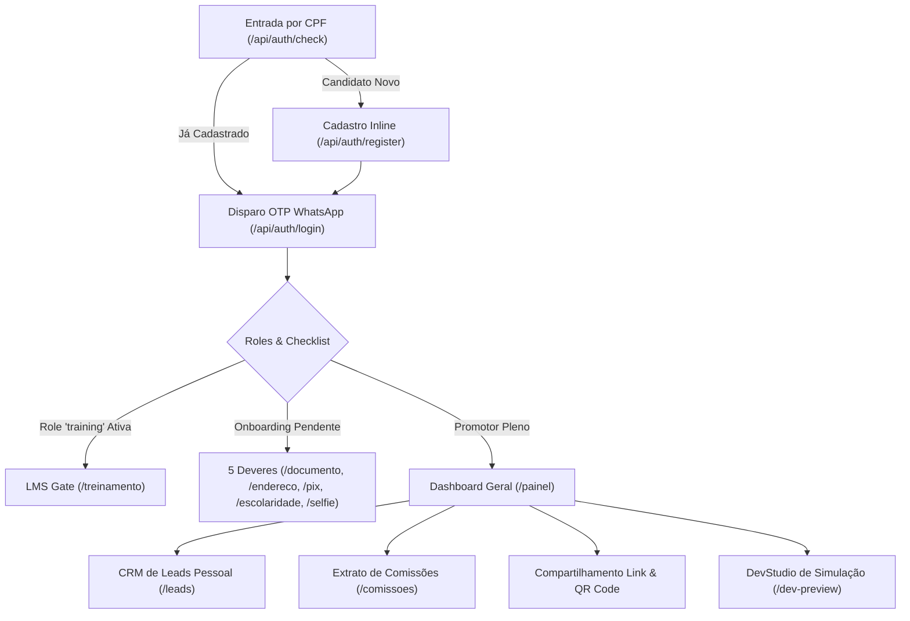

# Plano de Testes E2E Aprofundado: Portal do Promotor (app.maestri.group)

**Ambiente Alvo:** `http://127.0.0.1:3001`  
**Aplicações e Serviços:** `apps/app-promotor`, `apps/landing-promotor`, `services/backend`  
**Escopo:** Fluxo completo de entrada por CPF / OTP WhatsApp, Onboarding dos 5 Deveres de Validação Cadastral e Antifraude, Dashboard de Performance & Gamificação Semanal, Gestão e Acompanhamento de Leads no CRM Pessoal, Extrato Financeiro de Comissões e Liberações, Trilha LMS com Bloqueio Obrigatório (LMS Gate) e Estúdio de Simulação UI/UX DevStudio (`/dev-preview`).

---

## 1. Arquitetura e Fluxos do Portal do Promotor

O Portal do Promotor V7M (`app.maestri.group` na porta local `3001`) é o ambiente operacional de vendas e capacitação do ecossistema educacional. A aplicação organiza-se em camadas integradas:

### Regras Centrais de Negócio
1. **Entrada Simplificada por CPF:** O usuário digita apenas o CPF no formulário de entrada. O backend identifica o status do cadastro, envia código OTP via WhatsApp formatado com máscara e direciona para login ou cadastro inline.
2. **Onboarding dos 5 Deveres (Checklist de Liberação de Saques):**
   * **Dever 1 (`/documento`):** Upload de documento oficial com foto (RG/CNH), extração OCR de dados em segundo plano e validação de legibilidade.
   * **Dever 2 (`/endereco`):** Consulta assistida de CEP (ViaCEP), preenchimento automático de logradouro/bairro/cidade e anexo do comprovante de residência.
   * **Dever 3 (`/pix`):** Validação de chave Pix (CPF, Celular, E-mail ou Chave Aleatória) com checagem DICT de mesma titularidade e abertura do *PixDiagnosticDrawer* em caso de erro.
   * **Dever 4 (`/escolaridade`):** Registro de nível educacional e dados formativos.
   * **Dever 5 (`/selfie`):** Captura de biometria facial ao vivo sem acessórios e aceite legal do Termo de Adesão e Parceria.
3. **Liberação Gradativa vs Saques:** O promotor pode começar a divulgar seu link imediatamente após o início do cadastro. No entanto, as comissões acumuladas ficam bloqueadas para saque via Pix na sexta-feira até que todos os 5 deveres sejam homologados como `approved`.
4. **Gamificação e Metas:** Meta padrão de **5 matrículas pagas por semana** para liberação de **R$ 500,00 de bônus fixo** (além dos R$ 100,00 por matrícula), com cronômetro regressivo para o fechamento semanal nas sextas-feiras às 21h.
5. **LMS Gate:** Trava de segurança no roteamento. Usuários com role `training` não acessam ferramentas de venda até aprovação de todas as matérias obrigatórias pela IA de correção.
6. **DevStudio (`/dev-preview`):** Ferramenta avançada de desenvolvimento para simulação 1-Click de todos os estados do promotor, injeção de falhas HTTP (429, 409, 500, payload > 8MB), alternância de tema e verificação de alvos de toque (≥44px).

---

## 2. Matriz de Cenários de Testes E2E

| ID do Cenário | Módulo / Rota | Título / Objetivo | Severidade |
| :--- | :--- | :--- | :--- |
| **TC-PROMOTOR-DEEP-001** | `/` (Entrada) | Validação client-side do formato de CPF e aplicação de máscara | Crítica |
| **TC-PROMOTOR-DEEP-002** | `/` (Entrada) | Verificação de CPF inexistente e transição para cadastro inline | Alta |
| **TC-PROMOTOR-DEEP-003** | `/` (Entrada) | Tratamento de CPF existente com disparo de OTP via WhatsApp | Crítica |
| **TC-PROMOTOR-DEEP-004** | `/` (Entrada) | Tratamento de erro `RATE_LIMITED` com contagem regressiva de bloqueio | Alta |
| **TC-PROMOTOR-DEEP-005** | `/` (Entrada) | Validação do código OTP (6 dígitos) e login com transição para painel | Crítica |
| **TC-PROMOTOR-DEEP-006** | `/documento` | Dever 1: Upload de documento frontal/verso e processamento assíncrono de OCR | Crítica |
| **TC-PROMOTOR-DEEP-007** | `/documento` | Dever 1: Tratamento de documento ilegível / rejeitado com pedido de ajuste | Alta |
| **TC-PROMOTOR-DEEP-008** | `/endereco` | Dever 2: Busca de CEP com preenchimento automático e envio de comprovante | Alta |
| **TC-PROMOTOR-DEEP-009** | `/pix` | Dever 3: Validação de chave Pix de mesma titularidade via DICT | Crítica |
| **TC-PROMOTOR-DEEP-010** | `/pix` | Dever 3: Abertura e diagnóstico no `PixDiagnosticDrawer` em caso de divergência | Média |
| **TC-PROMOTOR-DEEP-011** | `/escolaridade` | Dever 4: Seleção de escolaridade e envio de formulário | Média |
| **TC-PROMOTOR-DEEP-012** | `/selfie` | Dever 5: Captura de selfie biométrica e assinatura do Termo de Adesão | Alta |
| **TC-PROMOTOR-DEEP-013** | `/painel` | Termômetro da meta semanal (X/5) e cálculo do bônus de R$ 500,00 | Crítica |
| **TC-PROMOTOR-DEEP-014** | `/painel` | Contador regressivo (Countdown) de fechamento semanal nas sextas | Média |
| **TC-PROMOTOR-DEEP-015** | `/painel` | Central de Compartilhamento: Cópia rápida, link WhatsApp e modal de QR Code | Alta |
| **TC-PROMOTOR-DEEP-016** | `/painel` | Banner de status dos 5 deveres e indicação de saques liberados/bloqueados | Alta |
| **TC-PROMOTOR-DEEP-017** | `/leads` | Listagem de leads com badge de status (Aguardando, Pago nesta semana, Recebido) | Alta |
| **TC-PROMOTOR-DEEP-018** | `/leads` | Ação de contato/lembrete no WhatsApp para leads com matrícula pendente | Média |
| **TC-PROMOTOR-DEEP-019** | `/comissoes` | Extrato financeiro: Cálculo de saldo acumulado, saldo a liberar e bloqueado | Crítica |
| **TC-PROMOTOR-DEEP-020** | `/comissoes` | Histórico detalhado de comissões por matrícula e bônus de meta | Alta |
| **TC-PROMOTOR-DEEP-021** | `/treinamento` | LMS Gate: Bloqueio do painel e redirecionamento forçado para treinamento | Crítica |
| **TC-PROMOTOR-DEEP-022** | `/treinamento` | Resolução de questionário/quiz com feedback de correção automática por IA | Alta |
| **TC-PROMOTOR-DEEP-023** | `/treinamento` | Desbloqueio e redirecionamento automático para o painel após conclusão | Alta |
| **TC-PROMOTOR-DEEP-024** | `/dev-preview` | Cenários 1-Click: Candidato Novo (0/5), Em Análise OCR (2/5) e Promotor Pleno | Média |
| **TC-PROMOTOR-DEEP-025** | `/dev-preview` | Simulação de erros de API: Rate Limit 429, Conflito 409 e Arquivo > 8MB | Alta |
| **TC-PROMOTOR-DEEP-026** | `/dev-preview` | Teste de viewports móveis (375px, 393px, 412px) e inspetor de alvos ≥44px | Média |

---

## 3. Especificação Detalhada dos Casos de Teste

### Módulo 1: Entrada, Validação de CPF e Autenticação OTP (`/`)

#### TC-PROMOTOR-DEEP-001: Validação de Formato e Máscara de CPF
* **Objetivo:** Garantir que o campo de CPF aplique formatação automática `000.000.000-00` e valide os dígitos verificadores antes de disparar requisição ao backend.
* **Pré-condições:** Aplicação em execução em `http://127.0.0.1:3001/`.
* **Passos de Teste:**
  1. Navegar para `http://127.0.0.1:3001/`.
  2. Localizar o input com selector `#auth-cpf` ou role `textbox "Seu CPF"`.
  3. Digitar números sequenciais: `11144477735`.
  4. Verificar se o valor no input é formatado dinamicamente como `111.444.777-35`.
  5. Apagar o último dígito e clicar fora (evento `blur`) ou acionar o botão "Continuar".
* **Resultados Esperados:**
  * O input exibe mensagem de erro inline: "Esse CPF não fechou — confira os números e tente de novo.".
  * A classe CSS `field-shake` é aplicada ao container do formulário para feedback visual.
  * O formulário bloqueia o envio (`fetch`) enquanto o CPF for inválido.

#### TC-PROMOTOR-DEEP-002: Fluxo de Novo Candidato com Cadastro Inline
* **Objetivo:** Validar o roteamento para preenchimento de telefone e e-mail quando o CPF não existe na base.
* **Pré-condições:** CPF válido e não cadastrado (ex: `00000000191` ou gerado dinamicamente).
* **Passos de Teste:**
  1. Inserir CPF não cadastrado no campo `#auth-cpf`.
  2. Clicar em "Continuar".
  3. Observar a transição suave de estágio para `register`.
  4. Preencher Telefone `(42) 99999-8888` e E-mail `promotor.teste@maestri.group`.
  5. Clicar em "Enviar código de confirmação".
* **Resultados Esperados:**
  * Requisição `POST /api/auth/register` enviada com sucesso.
  * O formulário avança para o estágio `otp` (código de 6 dígitos).
  * O temporizador de reenvio inicia em 60 segundos (`otp_wait`).

#### TC-PROMOTOR-DEEP-003: Login de Promotor Cadastrado e Envio de OTP
* **Objetivo:** Testar a autenticação de usuário existente com envio de OTP via WhatsApp.
* **Pré-condições:** Promotor previamente cadastrado com CPF `111.444.777-35`.
* **Passos de Teste:**
  1. Informar o CPF no campo `#auth-cpf`.
  2. Clicar em "Continuar".
  3. Interceptar resposta `POST /api/auth/check` retornando `{ found: true, otp_sent: true, masked_phone: "(**)...-8750" }`.
  4. Verificar se o aviso "Código enviado para o WhatsApp (**)...-8750" é renderizado.
  5. Preencher os 6 blocos do componente `OtpInput` com o código recebido (`123456`).
  6. Submeter o formulário de login.
* **Resultados Esperados:**
  * O componente `AuthOverlay` surge cobrindo a tela durante a transição.
  * O cookie de sessão HTTP-only é gravado.
  * O usuário é redirecionado para a rota `/painel`.

#### TC-PROMOTOR-DEEP-004: Tratamento de Erros e Rate Limiting
* **Objetivo:** Verificar a resiliência contra excesso de requisições e mensagens de erro acolhedoras.
* **Passos de Teste:**
  1. Simular resposta HTTP 429 com envelope `{ code: "RATE_LIMITED", retry_after_s: 30 }`.
  2. Verificar texto em tela.
  3. Simular resposta com `{ code: "CPF_EXISTS" }` no fluxo de cadastro.
* **Resultados Esperados:**
  * Para Rate Limit: Exibe "Muitas tentativas seguidas. Respira 30 segundos e tente de novo." e trava o botão de reenvio pelo período.
  * Para CPF_EXISTS: Exibe "Esse CPF já tem cadastro por aqui — entre com o telefone dele.".

---

### Módulo 2: Onboarding dos 5 Deveres de Validação

#### TC-PROMOTOR-DEEP-006: Dever 1 - Documento Oficial (RG / CNH)
* **Objetivo:** Testar o envio de documento com análise assíncrona de OCR.
* **Pré-condições:** Usuário logado em estado `candidate` com Dever 1 pendente.
* **Passos de Teste:**
  1. Acessar `http://127.0.0.1:3001/documento`.
  2. Verificar cabeçalho "Etapa 1 de 5: Seu documento (RG ou CNH)".
  3. Fazer upload de foto da frente e verso (formato JPG, PNG ou PDF até 8MB).
  4. Clicar em "Enviar para Análise".
* **Resultados Esperados:**
  * O status do documento transita para `pending` (Em análise ⏳).
  * O promotor não fica bloqueado na tela e pode prosseguir para as próximas etapas ou painel.

#### TC-PROMOTOR-DEEP-008: Dever 2 - Endereço e Comprovante de Residência
* **Objetivo:** Validar preenchimento assistido por CEP e upload do comprovante.
* **Pré-condições:** Usuário na rota `/endereco`.
* **Passos de Teste:**
  1. Acessar `http://127.0.0.1:3001/endereco`.
  2. Digitar o CEP `84010-000`.
  3. Validar se os campos Logradouro, Bairro, Cidade e UF são preenchidos automaticamente.
  4. Inserir o Número `100` e Complemento `Apto 101`.
  5. Anexar fatura/comprovante de residência.
  6. Submeter formulário.
* **Resultados Esperados:**
  * Dados salvos via `POST /api/v1/collaborators/candidate/me/address`.
  * Dever 2 marcado como `pending` ou `approved`.

#### TC-PROMOTOR-DEEP-009 & TC-PROMOTOR-DEEP-010: Dever 3 - Chave Pix DICT e Drawer de Diagnóstico
* **Objetivo:** Testar a validação transacional da chave Pix e abertura do Drawer de Diagnóstico em caso de falha.
* **Pré-condições:** Usuário na rota `/pix`.
* **Passos de Teste:**
  1. Acessar `http://127.0.0.1:3001/pix`.
  2. Selecionar o tipo de chave `CPF` e digitar o mesmo CPF do cadastro.
  3. Clicar em "Validar Chave Pix".
  4. Simular cenário de sucesso: DICT confirma titularidade -> Exibe badge "Validada ✓".
  5. Simular cenário de divergência (chave de terceiro ou CPF divergente):
     * Clicar no gatilho do `PixDiagnosticDrawer`.
     * Validar se a gaveta exibe orientações detalhadas ("A chave Pix precisa estar no mesmo CPF do titular cadastrado").
* **Resultados Esperados:**
  * Chaves válidas são homologadas instantaneamente.
  * Erros no DICT abrem o drawer com passos claros de correção sem frustrar o usuário.

#### TC-PROMOTOR-DEEP-012: Dever 5 - Selfie Biométrica e Termo de Parceria
* **Objetivo:** Finalizar o onboarding com captura facial e aceite dos termos.
* **Pré-condições:** Usuário na rota `/selfie`.
* **Passos de Teste:**
  1. Acessar `http://127.0.0.1:3001/selfie`.
  2. Acionar a câmera ou enviar foto ao vivo sem óculos.
  3. Clicar em "Ler Termo de Adesão" -> abre o `AgreementSheet`.
  4. Rolar até o fim do termo e marcar o checkbox "Li e aceito os termos do Programa de Promotores V7M".
  5. Clicar em "Finalizar e Liberar Saques".
* **Resultados Esperados:**
  * Transição de papel para promotor ativo.
  * Redirecionamento para `/painel` com selo "Ativo" e progresso de deveres atualizado.

---

### Módulo 3: Dashboard de Performance e Gamificação (`/painel`)

#### TC-PROMOTOR-DEEP-013 & TC-PROMOTOR-DEEP-014: Metas Semanais e Contagem Regressiva
* **Objetivo:** Validar os cards de métricas, termômetro da meta `X / 5`, cálculo de bônus e contador regressivo.
* **Pré-condições:** Promotor autenticado com dados de resumo carregados.
* **Passos de Teste:**
  1. Acessar `http://127.0.0.1:3001/painel`.
  2. Localizar o bloco "Meta da semana".
  3. Conferir o indicador de progresso (ex: `🔥 2 / 5` matrículas).
  4. Validar o texto auxiliar: "Faltam 3 matrículas pra meta. Bata 5 matrículas e ganhe R$ 1.000 no bolso + Bolsa 100% gratuita.".
  5. Inspecionar o componente `Countdown`: validar formato "fecha em Xd Yh" (calculado a partir de `next_closing_at`).
  6. Verificar os valores em "Recebido" e "Previsto" formatados em moeda BRL (`formatBRL`).
* **Resultados Esperados:**
  * Métricas atualizadas sem NaN ou valores indefinidos.
  * O cronômetro regressivo reflete com precisão a data de fechamento semanal.

#### TC-PROMOTOR-DEEP-015: Central de Captação e Compartilhamento (WhatsApp & QR Code)
* **Objetivo:** Validar os atalhos de divulgação de link de indicação.
* **Passos de Teste:**
  1. No card "Seu link de indicação", localizar o código do link (ex: `https://supletivo.net.br/?ref=mariana99`).
  2. Clicar no botão "Copiar".
  3. Validar feedback visual de cópia (ícone de check ou tooltip "Copiado!").
  4. Clicar no botão "Enviar no WhatsApp" -> validar que a URL gerada aponta para `api.whatsapp.com/send` contendo mensagem persuasiva e o parâmetro `?ref=...`.
  5. Clicar em "Mais opções" / "Gerar QR Code".
* **Resultados Esperados:**
  * Geração instantânea do QR Code com leitura compatível em smartphones.

---

### Módulo 4: CRM de Leads e Extrato de Comissões (`/leads` e `/comissoes`)

#### TC-PROMOTOR-DEEP-017 & TC-PROMOTOR-DEEP-018: Gestão de Leads e Contato Rápido
* **Objetivo:** Monitorar o pipeline de indicações do promotor e interagir com leads pendentes.
* **Passos de Teste:**
  1. Acessar `http://127.0.0.1:3001/leads`.
  2. Verificar a renderização dos leads com iniciais no avatar e data formatada.
  3. Checar a diferenciação de badges:
     * `Aguardando` (lead iniciou o funil mas não concluiu pagamento).
     * `Pago · cai sexta` (matrícula paga na semana corrente).
     * `Recebido ✓` (matrícula paga em semanas anteriores, comissão já creditada).
  4. Clicar em um lead no estado `Aguardando` e acionar o botão de suporte via WhatsApp.
* **Resultados Esperados:**
  * Carregamento fluido da listagem sem paginação travada.
  * Roteamento para conversa com mensagem contextual de incentivo à conclusão da matrícula.

#### TC-PROMOTOR-DEEP-019 & TC-PROMOTOR-DEEP-020: Extrato Financeiro e Transparência de Repasses
* **Objetivo:** Validar o cálculo de saldo acumulado, saldo previsto para a próxima sexta e bloqueios de validação.
* **Passos de Teste:**
  1. Acessar `http://127.0.0.1:3001/comissoes`.
  2. Checar os 3 blocos do grid financeiro:
     * **Acumulado Recebido:** Soma de todas as comissões pagas no histórico.
     * **Sai na Próxima Sexta:** Comissões da semana + bônus de meta (se atingida), liberados para promotores com 5/5 deveres aprovados.
     * **Bloqueado por Validação:** Comissões acumuladas retidas caso existam deveres pendentes de aprovação.
  3. Checar a listagem de comissões individuais com data, tipo de origem (`Matrícula paga` ou `Bônus da meta`) e valor em R$.
* **Resultados Esperados:**
  * Correspondência matemática exata entre as matrículas confirmadas e os totais exibidos.

---

### Módulo 5: LMS e Capacitação Obrigatória (`/treinamento`)

#### TC-PROMOTOR-DEEP-021 a TC-PROMOTOR-DEEP-023: Bloqueio LMS Gate e Avaliação com IA
* **Objetivo:** Garantir que promotores com pendências de treinamento não acessem ferramentas de venda até concluir os módulos.
* **Pré-condições:** Sessão de usuário com a role `training`.
* **Passos de Teste:**
  1. Tentar acessar diretamente `http://127.0.0.1:3001/painel`.
  2. Validar o redirecionamento forçado para `/treinamento`.
  3. Verificar a barra de progresso "Matérias obrigatórias concluídas: X de Y".
  4. Clicar na matéria em destaque: "Próxima matéria obrigatória".
  5. Acessar a tela da matéria `/treinamento/[materialId]`, assistir ao conteúdo e submeter a resposta/quiz.
  6. Observar o estado de correção pela IA: `pending` -> "A IA está conferindo sua resposta em instantes".
  7. Simular aprovação: o componente `TrainingRefresh` detecta a conclusão, exibe o banner "✓ Treinamento concluído" e redireciona para o `/painel`.
* **Resultados Esperados:**
  * O LMS Gate bloqueia o acesso indevido e desbloqueia em tempo real após a homologação das respostas.

---

### Módulo 6: DevStudio & Simulações Visuais (`/dev-preview`)

#### TC-PROMOTOR-DEEP-024 a TC-PROMOTOR-DEEP-026: Simulação 1-Click e Testes de Resiliência
* **Objetivo:** Utilizar o estúdio de desenvolvimento para validação ágil de todos os estados visuais da aplicação.
* **Passos de Teste:**
  1. Acessar `http://127.0.0.1:3001/dev-preview`.
  2. Alternar entre os botões de **Cenários Prontos (1-Click)**:
     * `🌱 Candidato Novo (0/5)` -> Painel exibe 0 deveres, link ativo e status Iniciado.
     * `⏳ Em Análise OCR (2/5 + Fila)` -> Deveres 1 e 2 em análise, progresso 2/5.
     * `⚠️ Ajuste Necessário (Reprovações)` -> Banners de erro e necessidade de reenvio de documento.
     * `⚡ Promotor Pleno (5/5 Aprovado)` -> Selo verde Ativo, saques liberados.
     * `🏆 Campeão da Meta (5/5 Leads + Bônus)` -> Termômetro cheio, bônus de R$ 500,00 adicionado.
     * `🔒 Trava de Treinamento (LMS Gate)` -> Interface de treinamento obrigatório.
  3. Testar a simulação de erros de API:
     * Clicar em "Rate Limit (429)" -> Validar exibição do banner de erro 429.
     * Clicar em "Arquivo > 8MB" -> Validar alerta de tamanho excessivo.
     * Clicar em "Rede Oscilou" -> Validar mensagem de recuperação sem perda de estado.
  4. Testar a ferramenta **🎯 Alvos ≥44px**:
     * Clicar no botão e verificar se todos os elementos clicáveis recebem marcação visual de conformidade com diretrizes de acessibilidade touch.
  5. Alternar entre larguras de viewport (`375px`, `393px`, `412px`, `Auto`) e alternância de tema Claro/Escuro.
* **Resultados Esperados:**
  * Todas as mutações de estado ocorrem instantaneamente em memória sem erros no console.
