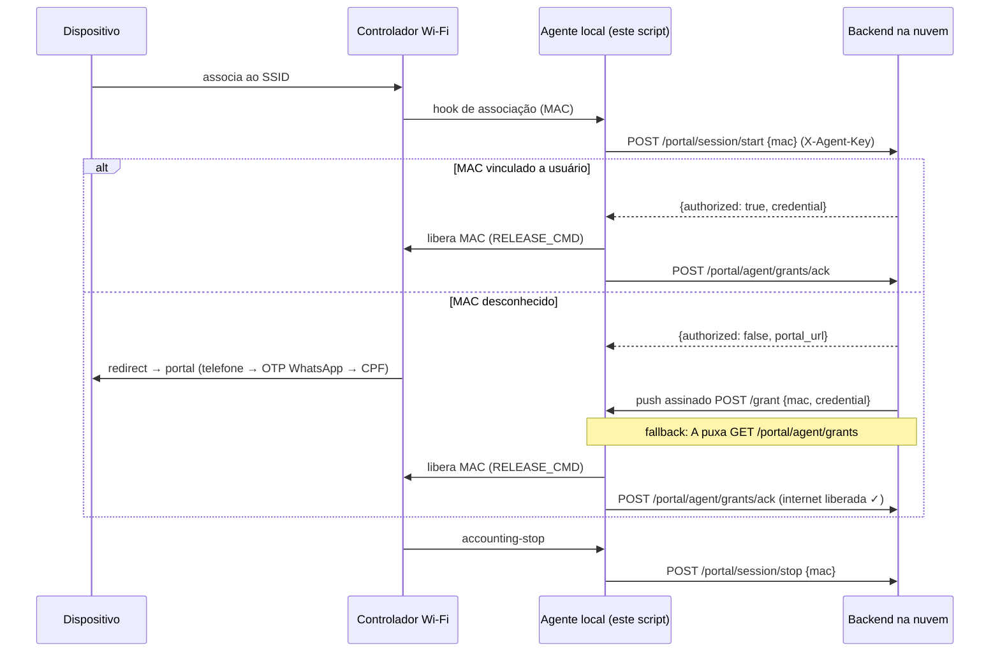

# Agente local do Captive Portal Wi-Fi

Ponta local do design **"Fluxo Captive Portal IEADPG"**. Roda num servidor na
rede da igreja (ao lado do controlador Wi-Fi) e conversa com o backend na
nuvem. Só stdlib do Python 3 — sem dependências.

## Arquitetura



A **credencial** é `base64url(payload).hmac_sha256` assinada com o segredo
compartilhado — o agente valida assinatura + expiração antes de liberar, e o
payload identifica o MAC autorizado (`{"mac", "sid", "exp"}`).

## Configuração

Mesmos valores do `.env` do backend:

```bash
export CAPTIVE_CLOUD_URL=https://backend.ieadpg.org
export CAPTIVE_AGENT_KEY=<chave-do-agente-local>       # = CAPTIVE_AGENT_KEY do backend
export CAPTIVE_AGENT_SECRET=<segredo-hmac-compartilhado> # = CAPTIVE_AGENT_SECRET do backend
export CAPTIVE_LISTEN_PORT=8899                        # listener do push (opcional)
export CAPTIVE_POLL_INTERVAL=10                        # polling (funciona atrás de NAT)
```

No backend, aponte o push pro agente (opcional — sem isso o polling resolve):

```bash
CAPTIVE_LOCAL_CALLBACK_URL=http://10.1.20.50:8899/grant
```

### Comando de liberação (`RELEASE_CMD`)

`{mac}` é substituído pelo MAC autorizado. Exemplos:

```bash
# UniFi (via API do controlador, guest authorize):
export RELEASE_CMD='curl -sk -X POST https://10.1.20.2:8443/api/s/default/cmd/stamgr \
  -b /tmp/unifi.cookie -d {"cmd":"authorize-guest","mac":"{mac}","minutes":720}'

# iptables/nftables (gateway Linux com walled garden):
export RELEASE_CMD='iptables -t mangle -D CAPTIVE -m mac --mac-source {mac} -j DROP'

# Mikrotik (via ssh):
export RELEASE_CMD='ssh admin@10.1.20.1 /ip hotspot ip-binding add mac-address={mac} type=bypassed'
```

Sem `RELEASE_CMD` o agente loga a liberação simulada (modo dev).

## Uso

```bash
python3 agent.py run                    # listener de push + polling (daemon)
python3 agent.py session-start <mac>    # dispositivo associou (hook do controlador)
python3 agent.py session-stop <mac>     # accounting-stop → grava disconnected_at
python3 agent.py ping                   # testa o vínculo com a nuvem
```

`session-start` imprime a `portal_url` quando o MAC é desconhecido — o
controlador usa essa URL como external portal (walled garden liberado pro
domínio do backend).

## Endpoints da nuvem usados

| Método | Path                       | Uso                                        |
|--------|----------------------------|--------------------------------------------|
| POST   | `/portal/session/start`    | passo 02 — MAC associou ao SSID            |
| POST   | `/portal/session/stop`     | accounting-stop → `disconnected_at`        |
| GET    | `/portal/agent/grants`     | polling de liberações pendentes            |
| POST   | `/portal/agent/grants/ack` | confirma liberação aplicada (internet ok)  |
| GET    | `/portal/agent/ping`       | health-check                               |

Todos autenticados com o header `X-Agent-Key`.
