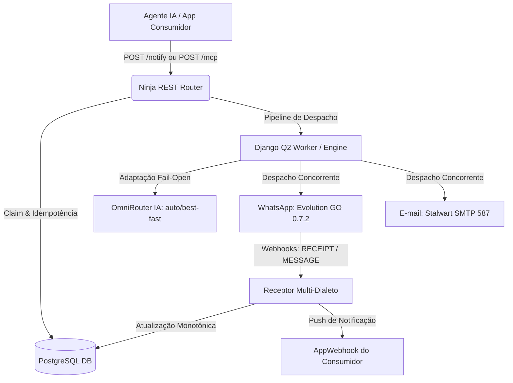

# Manual Operacional e Guia de Integração de IA — Notify Server

> **Público-Alvo**: Agentes de IA autônomos (MCP/REST), sistemas consumidores, backends e desenvolvedores que interagem com o ecossistema Notify.

---

## 1. Diretrizes Comportamentais de IA (Core Rules)

### 1.1. Think Before Coding
- **Não assuma. Não esconda confusão. Explicite suposições e tradeoffs.**
- Se houver ambiguidades sobre canais, destinatários ou templates, confirme antes de disparar envios em massa.

### 1.2. Simplicity First
- **Código e payloads mínimos que resolvem a tarefa.**
- Utilize o contrato unificado `POST /notify` sempre que possível. Evite chamadas legadas complexas a menos que haja restrições explícitas.

### 1.3. Surgical Changes & Validação Empírica
- **Nunca confie apenas em mocks unitários sintéticos.**
- Valide disparos reais inspecionando o status da notificação no banco de dados (`sent`, `delivered`, `read`) ou consultando `GET /v1/notifications/{external_id}`.
- Sincronize explicitamente alterações de código com os containers Docker (`v7m-notify-web`, `v7m-notify-worker`).

---

## 2. Visão Geral e Arquitetura do Sistema

O **Notify Server** é o hub centralizado de mensageria, notificações multicanal e integração de IA:



### Princípios Fundamentais:
1. **Isolamento Multi-Tenant Estrito (1 App = 1 Account)**:
   - Cada conta (`Account`) possui seus próprios números de WhatsApp (`WhatsAppNumber`), identidades de e-mail (`MailIdentity`), templates HTML (`MailTemplate`), chaves de API (`ApiKey`) e endpoints de webhook (`AppWebhook`).
2. **Relay Desacoplado (Não é Caixa Postal)**:
   - O Notify entrega mensagens e devolve o ciclo de vida. Quem persiste o histórico de conversa de negócio é a aplicação consumidora.
3. **Fail-Open Inteligente (Resiliência de IA e Recursos Ricos)**:
   - Se o gateway de IA (OmniRouter) estiver fora, a mensagem original é entregue sem travar o pipeline.
   - Se um recurso interativo de WhatsApp (como Botão Pix ou Enquete) não puder ser entregue nativamente pelo dispositivo do destinatário, o sistema converte automaticamente o recurso em texto formatado legível.

---

## 3. Autenticação & Resolução de Tenant

O Notify Server opera em rede protegida (VPN / localhost / Docker Network) e suporta autenticação flexível com **ordem estrita de precedência**:

1. **Header `Authorization: Bearer <API_KEY>`**:
   - Resolve a conta atrelada à chave de API cadastrada.
2. **Campo `account_id` no Payload JSON ou Query String**:
   - Aceita o `slug` da conta (ex: `"default"`, `"ieadpg"`, `"test"`) ou o ID numérico inteiro (ex: `1`, `2`).
3. **Conta Padrão (`default`)**:
   - Caso nenhum dos anteriores seja informado, assume a conta `default`.

---

## 4. O Contrato Principal: `POST /notify` (IA-First)

O endpoint `/notify` utiliza o **Princípio da Presença**: os canais são ativados pela simples inclusão do destinatário correspondente no payload.

### Tabela de Decisão de Canais:
| Campo `whatsapp` | Campo `email` | Canais Ativados | Comportamento |
|---|---|---|---|
| Preenchido | Omitido / `null` | `["whatsapp"]` | Despacho exclusivo via WhatsApp (Evolution GO). |
| Omitido / `null` | Preenchido | `["email"]` | Despacho exclusivo via E-mail (Stalwart SMTP 587). |
| Preenchido | Preenchido | `["whatsapp", "email"]` | **Despacho Paralelo Simultâneo** em ambos os canais. |
| Omitido / `null` | Omitido / `null` | Nenhum | Retorna erro HTTP 400 (`"Informe ao menos um destino"`). |

---

### 4.1. Estrutura do Payload Padrão

```json
{
  "content": "Olá! Sua matrícula foi confirmada com sucesso.",
  "account_id": "test",
  "whatsapp": "5543996648750",
  "email": "aluno@v7m.org",
  "options": {
    "title": "Confirmação de Matrícula",
    "subject": "🎓 Bem-vindo à V7M Educacional",
    "caller": "agente-onboarding",
    "run_sync": true
  }
}
```

#### Parâmetros do Payload:
- **`content`** *(obrigatório, string)*: Texto principal da mensagem (aceita Markdown).
- **`account_id`** *(opcional, string|int)*: Slug ou ID do tenant de envio.
- **`whatsapp`** *(opcional, string)*: Telefone no padrão E.164 **apenas com dígitos** (ex: `5543996648750`). Não inclua `+`, espaços ou hífens.
- **`email`** *(opcional, string)*: Endereço de e-mail de destino.
- **`options`** *(opcional, objeto)*:
  - `title` *(string)*: Título da mensagem (destacado no topo do WhatsApp e no header do e-mail).
  - `subject` *(string)*: Assunto customizado para o e-mail.
  - `caller` *(string, default "notify")*: Identificador do módulo/agente que disparou o envio para auditoria.
  - `run_sync` *(boolean, default false)*: Se `true`, executa o envio síncrono imediato na requisição; se `false`, enfileira no worker Django-Q2.
  - `external_id` *(string)*: Chave de idempotência do cliente (ou use o header HTTP `Idempotency-Key`).
  - `media_url` *(string)*: URL pública ou acessível na rede para envio de mídia/anexo.
  - `media_type` *(string: `image` | `video` | `audio` | `document`)*: Tipo da mídia informada.

---

### 4.2. Formatos Ricos no WhatsApp (`options.*`)

> [!NOTE]
> No WhatsApp, utilize **apenas um** recurso rico por requisição. Todos contam com degradação graciosa (*fail-open*).

#### 1. Botão Pix Nativo (`options.pix`)
Gera um card oficial no WhatsApp com botão de cópia de chave Pix com 1 toque:
```json
{
  "content": "Fatura mensal de serviços gerada.",
  "account_id": "default",
  "whatsapp": "5543996648750",
  "options": {
    "title": "Mensalidade V7M",
    "run_sync": true,
    "pix": {
      "key": "financeiro@v7m.org",
      "key_type": "email",
      "name": "V7M Educacional",
      "label": "Copiar Chave Pix"
    }
  }
}
```
*Tipos aceitos em `key_type`: `"cpf"`, `"cnpj"`, `"phone"`, `"email"`, `"random"`. Para QR Code copia-e-cola (EMV), utilize `"payload": "000201..."`.*

#### 2. Enquete Interativa (`options.poll`)
Envia uma enquete nativa de votação no WhatsApp:
```json
{
  "content": "Pesquisa de Satisfação",
  "account_id": "default",
  "whatsapp": "5543996648750",
  "options": {
    "run_sync": true,
    "poll": {
      "question": "Como você avalia nosso atendimento?",
      "options": ["10 - Excelente", "9 - Muito Bom", "8 - Regular"],
      "selectable_count": 1
    }
  }
}
```

#### 3. Carrossel de Cards Interativos (`options.carousel`)
Lista deslizante de cards com imagens e botões de ação:
```json
{
  "content": "Conheça nossos cursos em destaque:",
  "account_id": "default",
  "whatsapp": "5543996648750",
  "options": {
    "run_sync": true,
    "carousel": {
      "body": "Selecione uma das opções abaixo:",
      "cards": [
        {
          "title": "Engenharia de Software",
          "text": "Formação completa com IA e microsserviços.",
          "image_url": "https://v7m.org/img/curso-eng.jpg",
          "buttons": [
            { "type": "URL", "display_text": "Ver Grade", "url": "https://v7m.org/eng" }
          ]
        }
      ]
    }
  }
}
```

#### 4. Cartão de Contato vCard (`options.contact`)
```json
{
  "content": "Segue o contato do coordenador responsável:",
  "whatsapp": "5543996648750",
  "options": {
    "contact": {
      "full_name": "Victor Maestri",
      "phone": "+5543996648750",
      "organization": "V7M Group"
    }
  }
}
```

#### 5. Localização Geográfica GPS (`options.location`)
```json
{
  "content": "Local do nosso próximo evento presencial:",
  "whatsapp": "5543996648750",
  "options": {
    "location": {
      "latitude": -25.0945,
      "longitude": -50.1633,
      "name": "Auditório Central V7M",
      "address": "Av. Principal, 1000 - Centro"
    }
  }
}
```

---

## 5. Catálogo Completo de Endpoints REST

| Método | Endpoint | Autenticação | Descrição |
|---|---|---|---|
| `POST` | `/notify` | Opcional (VPN/Key) | **Contrato Principal IA-First** para envio multicanal. |
| `POST` | `/v1/send` | Opcional (VPN/Key) | Endpoint legado com flags explícitas (`whatsapp: bool`, `email_channel: bool`). |
| `POST` | `/v1/send-event` | Opcional (VPN/Key) | Disparo baseado em templates dinâmicos cadastrados no banco. |
| `GET` | `/v1/notifications/{id}` | Opcional (VPN/Key) | Consulta status, tentativas e erros por UUID ou `Idempotency-Key`. |
| `GET` | `/v1/notifications` | Opcional (VPN/Key) | Listagem paginada de notificações do tenant com filtros. |
| `POST` | `/v1/phone/check` | Opcional (VPN/Key) | Verifica em lote se números existem no WhatsApp (`exists: true/false`). |
| `GET` | `/v1/health` | Pública | Healthcheck básico de liveness (status do banco de dados). |
| `GET` | `/v1/ready` | Pública | Readiness probe para deploy (DB + Tabela da Fila + Serviços). |
| `GET` | `/v1/metrics` | Pública | Métricas operacionais em tempo real (volume 1h/24h, erros, fila). |
| `POST` | `/v1/admin/apps` | Admin / VPN | Provisionamento atômico de novos tenants (contas, caixas, instâncias). |
| `GET` | `/v1/admin/apps` | Admin / VPN | Listagem de todos os tenants cadastrados. |
| `POST` | `/v1/admin/pairing-code` | Admin / VPN | Gera código de pareamento numérico de 8 dígitos para WhatsApp. |
| `POST` | `/mcp` | Pública / VPN | Servidor JSON-RPC 2.0 com 9 ferramentas para Agentes de IA. |

---

## 6. Servidor MCP JSON-RPC 2.0 (`POST /mcp`) para Agentes de IA

Para agentes autônomos que operam via protocolo **Model Context Protocol (MCP)**, o Notify Server disponibiliza 9 ferramentas integradas via JSON-RPC 2.0:

### 6.1. Ferramentas Disponíveis no MCP:
1. **`notify_send`**: Envia notificações via WhatsApp e/ou E-mail com opções ricas.
2. **`notify_send_event`**: Dispara eventos pré-configurados com interpolação de contexto (`ctx`).
3. **`notify_status`**: Consulta o estado de entrega de uma notificação por ID.
4. **`notify_history`**: Consulta o histórico recente de envios do tenant.
5. **`notify_inbox`**: Consulta mensagens recebidas via WhatsApp nos números da conta.
6. **`notify_phone_check`**: Valida a existência de números de telefone no WhatsApp.
7. **`notify_channels`**: Inspeciona a saúde e conexão das instâncias e caixas de correio da conta.
8. **`notify_templates`**: Lista os templates de e-mail e templates de evento da conta.
9. **`notify_template_upsert`**: Cria ou atualiza o shell HTML do e-mail da conta.

### 6.2. Exemplo de Chamada MCP (JSON-RPC):
```json
{
  "jsonrpc": "2.0",
  "id": 1,
  "method": "tools/call",
  "params": {
    "name": "notify_send",
    "arguments": {
      "account_id": "test",
      "whatsapp": "5543996648750",
      "content": "Mensagem enviada diretamente pelo Agente de IA via MCP."
    }
  }
}
```

---

## 7. Verificação de Números de Telefone (`POST /v1/phone/check`)

Antes de realizar envios críticos para novos números, consulte a existência da conta no WhatsApp:

```bash
curl -X POST http://127.0.0.1:8000/v1/phone/check \
  -H "Content-Type: application/json" \
  -d '{"numbers": ["5543996648750", "5511900000000"], "account_id": "default"}'
```

**Resposta:**
```json
[
  { "number": "554396648750", "exists": true },
  { "number": "5511900000000", "exists": false }
]
```

> [!IMPORTANT]
> Se o motor WhatsApp estiver temporariamente desconectado, o endpoint retorna **HTTP 503 (`whatsapp_session_down`)**, permitindo que o cliente distinga falha de infraestrutura de número inexistente (`exists: false`).

---

## 8. Consulta de Ciclo de Vida e Idempotência (`GET /v1/notifications/{id}`)

Cada notificação retorna um `external_id` (UUID). Você pode acompanhar o status completo da entrega:

```bash
curl -s http://127.0.0.1:8000/v1/notifications/653a7553-684e-47f1-9e7b-edfa0eb2e91f?account_id=test
```

**Resposta:**
```json
{
  "external_id": "653a7553-684e-47f1-9e7b-edfa0eb2e91f",
  "caller": "live-e2e",
  "recipient_phone": "5543996648750",
  "recipient_email": null,
  "whatsapp_status": "sent",
  "email_status": "skipped",
  "attempts": 1,
  "created_at": "2026-08-24T03:27:39.123456Z",
  "title": "Teste E2E Real",
  "text": "Olá Victor! Teste automatizado oficial...",
  "whatsapp_error": null,
  "email_error": null
}
```

### Estados Possíveis de Canal:
- **`pending`**: Na fila aguardando processamento pelo worker.
- **`sending`**: Bloqueio transacional obtido, em trânsito no provider.
- **`sent`**: Entregue com sucesso pelo driver (WhatsApp ou SMTP).
- **`delivered`**: Entregue no dispositivo do destinatário (dois ticks cinzas no WhatsApp).
- **`read`**: Lido pelo destinatário (dois ticks azuis no WhatsApp).
- **`failed`**: Falha definitiva após retries com registro do erro em `whatsapp_error` / `email_error`.
- **`skipped`**: Canal não solicitado para este envio.

---

## 9. Exemplos Práticos de Código para Consumo da API

### Python (com `httpx`):
```python
import httpx

def disparar_notificacao():
    url = "http://127.0.0.1:8000/notify"
    payload = {
        "account_id": "test",
        "whatsapp": "5543996648750",
        "email": "cliente@exemplo.com",
        "content": "Sua fatura foi processada com sucesso!",
        "options": {
            "title": "Notificação de Fatura",
            "subject": "Fatura Disponível - V7M",
            "run_sync": True,
            "pix": {
                "key": "financeiro@v7m.org",
                "key_type": "email",
                "name": "V7M Educacional",
                "label": "Pagar com Pix"
            }
        }
    }
    
    response = httpx.post(url, json=payload, timeout=15.0)
    response.raise_for_status()
    data = response.json()
    print(f"Notificação criada: UUID {data['external_id']} nos canais {data['channels']}")
```

### TypeScript / Node.js (com `fetch`):
```typescript
async function sendNotification() {
  const response = await fetch("http://127.0.0.1:8000/notify", {
    method: "POST",
    headers: { "Content-Type": "application/json" },
    body: JSON.stringify({
      account_id: "test",
      whatsapp: "5543996648750",
      content: "Seu código de acesso é: *982341*",
      options: {
        title: "Código de Segurança",
        run_sync: true
      }
    })
  });

  if (!response.ok) {
    throw new Error(`Erro na API Notify: ${response.statusText}`);
  }

  const result = await response.json();
  console.log("Sucesso:", result.external_id);
}
```

---

## 10. Checklist de Boas Práticas para Agentes de IA

1. **Validação Prévia de Números**: Use `POST /v1/phone/check` antes de disparos em lote para filtrar números sem WhatsApp.
2. **Idempotência Obrigatória**: Ao realizar operações financeiras ou de cobrança, envie sempre um UUID único no header `Idempotency-Key` ou em `options.external_id`.
3. **Formatação E.164 Limpa**: Remova sempre `+`, `(`, `)`, `-` e espaços dos números de telefone antes de enviá-los no payload.
4. **Respeito aos Limites de Mídia**: Para envio de anexos, garanta que URLs de mídia sejam diretas e públicas.
5. **Auditoria de Erros**: Se um envio retornar `failed`, consulte o endpoint `GET /v1/notifications/{id}` para obter o log detalhado gravado pelo driver.
