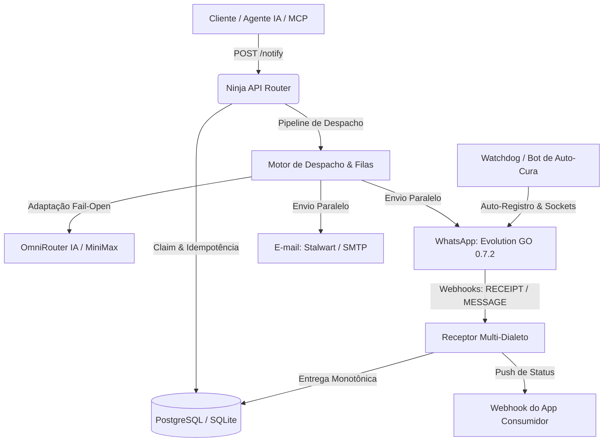

# 🔔 Notify Server — Relay de Mensageria & Notificações

Serviço centralizado de mensageria, notificações multicanal e integração de IA multi-tenant construído sobre **Django 5.2**, **Django Ninja (OpenAPI)**, **Django-Q2**, **Evolution GO 0.7.2** e **OmniRouter**. Operando em rede isolada LAN Proxmox (Porta `:8000`, sem exposição direta na WAN).

---

## 1. Visão Geral e Arquitetura

O **Notify** opera como o hub de comunicação e relay de notificações de todo o ecossistema. Ele recebe requisições de envio validadas, executa adaptação inteligente de conteúdo por canal via IA, despacha em paralelo para WhatsApp (Evolution GO nativo) e E-mail (Stalwart / SMTP) e devolve o ciclo de vida completo via webhooks monotônicos.



### Isolamento Multi-Tenant (1 App = 1 Account):
- Cada aplicação possui sua conta (`Account`), instâncias de WhatsApp (`WhatsAppNumber`), identidades de e-mail (`MailIdentity`), templates de e-mail customizados (`MailTemplate`), chaves de API (`ApiKey`) e endpoints de webhook (`AppWebhook`).

---

## 2. Stack Tecnológica

| Camada | Tecnologia | Função no Ecossistema |
|---|---|---|
| **API & Contratos** | Django 5.1 + Django Ninja (Pydantic v2) | Endpoints REST, tipagem estrita, Swagger/OpenAPI nativo em `/docs`. |
| **Fila & Agendamento** | Django-Q2 (Broker DB / PostgreSQL) | Processamento assíncrono, retries com backoff exponencial e rotinas de expurgo. |
| **Banco de Dados** | PostgreSQL 16 (Produção) / SQLite (Dev) | Isolamento multi-tenant, locks `select_for_update` e constraints únicas de idempotência. |
| **Motor WhatsApp** | Evolution GO 0.7.2 (whatsmeow / Go) | Conexões de alta performance, sessões em `evogo_auth` e recursos interativos nativos. |
| **Gateway de IA** | OmniRouter (`auto/best-fast`) | Adaptação contextual de mensagens por canal e transcrição de áudios (STT). |
| **Síntese de Voz** | MiniMax HD + Deepgram Aura-2 | Síntese de áudio (TTS) com entrega como nota de voz nativa (PTT) no WhatsApp. |
| **Servidor de E-mail** | Stalwart Mail Server 0.16.18 | JMAP API administrativa, SMTP com STARTTLS e proteção anti-spam com Message-ID/Date. |
| **Servidor MCP** | JSON-RPC 2.0 (`POST /mcp`) | 9 ferramentas integradas com isolamento multi-tenant para agentes autônomos. |

---

## 3. Catálogo de APIs e Contratos

### 3.1. Contrato Principal: `POST /notify` (IA-First)

Determina os canais de envio pela **presença** dos destinatários:
- `whatsapp` presente $\rightarrow$ canal WhatsApp acionado.
- `email` presente $\rightarrow$ canal E-mail acionado.
- Ambos presentes $\rightarrow$ despacho paralelo e concorrente em ambos os canais.
- `options` $\rightarrow$ ativa recursos ricos com **degradação graciosa (fail-open)**: se o recurso não puder ser entregue nativamente, o sistema converte automaticamente para texto formatado legível.

#### Exemplo de Payload Rico:
```json
{
  "content": "Sua fatura de R$ 150,00 foi gerada com sucesso.",
  "account_id": "default",
  "whatsapp": "5543996648750",
  "email": "aluno@exemplo.com",
  "options": {
    "title": "Mensalidade V7M",
    "run_sync": false,
    "pix": {
      "key": "financeiro@v7m.org",
      "key_type": "email",
      "name": "V7M Educacional",
      "label": "Copiar Chave Pix"
    }
  }
}
```

#### Recursos Ricos Homologados no WhatsApp:
1. **Botão Pix Nativo (`options.pix`)**: Cartão nativo do WhatsApp com botão de cópia de chave Pix (aceita `cpf`, `cnpj`, `phone`, `email`, `random`) ou geração de QR Code via imagem (`payload`).
2. **Carrossel Interativo (`options.carousel`)**: Cards deslizantes com imagens, descrições e botões de ação (`URL` ou `COPY`).
3. **Enquete Interativa (`options.poll`)**: Enquetes nativas de múltipla escolha com contagem de votos configurável (`maxAnswer` / `selectable_count`).
4. **Localização / Mapa (`options.location`)**: Ponto geográfico nativo (`latitude`, `longitude`, `name`, `address`) com fallback para link do Google Maps.
5. **Contato vCard (`options.contact`)**: Cartão de contato nativo (`full_name`, `phone`, `organization`).
6. **QR Code (`options.qr_code`)**: Gera imagem PNG determinística localmente e entrega como mídia.
7. **Nota de Voz TTS (`options.tts`)**: Sintetiza áudio via IA e entrega como nota de voz gravada no microfone (PTT).

---

### 3.2. Endpoints Operacionais e Administrativos

| Método | Endpoint | Descrição |
|---|---|---|
| `POST` | `/notify` | **Contrato principal IA-First** (WhatsApp, E-mail, Formatos Ricos). |
| `POST` | `/v1/send` | Envio direto com flags booleanas explícitas (compatibilidade legada). |
| `POST` | `/v1/send-event` | Envio baseado em templates e gatilhos do banco de dados. |
| `GET` | `/v1/notifications/{id}` | Consulta status por UUID interno ou `Idempotency-Key`. |
| `POST` | `/v1/phone/check` | Verifica existência de números no WhatsApp (distingue 503 de `exists: false`). |
| `GET` | `/v1/health` | Verificação de integridade básica (DB e status). |
| `GET` | `/v1/ready` | Verificação de prontidão para deploy (DB + fila). |
| `GET` | `/v1/metrics` | Métricas operacionais em tempo real (volume 1h/24h, falhas, fila). |
| `POST` | `/v1/admin/apps` | Provisionamento atômico e idempotente de aplicação (contas, instâncias, mailboxes). |
| `GET` | `/v1/admin/apps` | Inspeção detalhada de apps (sem queries N+1). |
| `POST` | `/v1/admin/pairing-code` | Gera código de pareamento numérico de 8 dígitos para WhatsApp. |
| `POST` | `/v1/webhook/evolution/{instance}` | Receptor multi-dialeto da Evolution GO (`MESSAGE`, `RECEIPT`, `HISTORY_SYNC`). |
| `POST` | `/v1/webhook/stalwart` | Receptor de eventos de e-mail e supressão de bounces. |
| `POST` | `/mcp` | Servidor JSON-RPC 2.0 MCP para agentes de IA autônomos. |

---

## 4. Bot de Auto-Cura e Watchdog (Resiliência Operacional)

O Notify possui um mecanismo perpétuo de auto-recuperação (`notify/watchdog.py`) que elimina qualquer necessidade de intervenção humana após reinicializações:

1. **Auto-Registro de Licença (`_check_and_heal_license`)**: Ao detectar resposta `503 LICENSE_REQUIRED` ou licença inativa no Evolution GO, dispara automaticamente `GET /license/register` com a chave administrativa.
2. **Reconexão Autônoma de Sockets (`_heal_go`)**: Itera sobre todas as instâncias cadastradas em `WhatsAppNumber` e aciona `POST /instance/connect` com os eventos do dialeto GO (`["MESSAGE", "READ_RECEIPT", "HISTORY_SYNC"]`), re-inicializando os sockets whatsmeow sem exigir QR code.
3. **Execução no Boot e em Background**:
   - Disparado no startup do container via `notify_bootstrap`.
   - Agendado periodicamente no worker Django-Q (`notify-watchdog`).
   - Disponível sob demanda via CLI: `python manage.py notify_autoheal`.

---

## 5. Dashboard e Painel Operacional

Acessível em `http://127.0.0.1:8000/` ou via rede local:

- **Visão Geral (`/`)**: Métricas de entrega, atalhos de envio rápido, checklist de setup e últimas notificações.
- **WhatsApp (`/dashboard/whatsapp/`)**: Gerenciamento de instâncias, status de conexão, pareamento por código/QR e forçar reconexão.
- **E-mail (`/dashboard/email/`)**: Credenciais SMTP/Stalwart, editor de shells HTML e teste de envio.
- **Envios (`/dashboard/messages/`)**: Histórico com filtros por canal/status, busca textual e reenvio de falhas (DLQ).
- **Recebidas (`/dashboard/inbox/`)**: Mensagens recebidas no WhatsApp com detalhes de repasse a webhooks.
- **Webhooks Stream (`/dashboard/webhooks/`)**: Feed ao vivo dos eventos capturados pelo receptor da Evolution GO com atualização automática a cada 3s via HTMX.
- **Configurações (`/dashboard/settings/`)**: Gerenciamento de chaves de API, webhook do app e testes de IA OmniRouter.
- **Assistente de Setup (`/dashboard/setup/`)**: Wizard passo a passo para configuração de novos tenants.

---

## 6. Desenvolvimento, Testes e Qualidade

### Executar a Suíte Completa de Testes:
```bash
# Testes Unitários e de Integração (274 testes)
pytest

# Teste E2E Ponta a Ponta (Validação de Servidor Vivo, Dashboard, MCP e Envio Real)
python tests/e2e_runner.py
```

### Comandos de Gerenciamento Django:
```bash
# Auto-cura de instâncias e licença do Evolution GO
python manage.py notify_autoheal

# Disparo de notificação via terminal
python manage.py notify_send --phone 5543996648750 --text "Mensagem de teste"

# Geração de chave de API
python manage.py create_api_key --account default --name "Chave Producao"

# Expurgo periódico de auditoria e logs antigos (>90 dias)
python manage.py notify_purge
```

