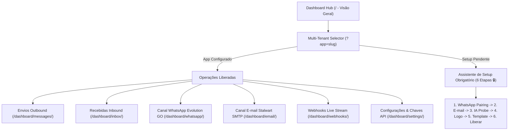

# Plano de Testes E2E: Dashboard Operacional & Multi-tenant do Notify

**Ambiente Alvo:** `http://localhost:8000` (Notify v7.2 - Hub Operacional HTMX)  
**Aplicações e Serviços:** `services/notify-server`, `services/evolution-go`, `services/stalwart-mail`, `services/omnirouter`  
**Escopo:** Painel de Operações Unificado HTMX, Visão Geral com KPIs e Disparo de Testes Imediatos, Assistente de Setup Multi-tenant (6 Etapas com Bloqueio 🔒), Histórico de Envios Outbound e Inbound, Gestão de Canais WhatsApp (Evolution GO) e E-mail (Stalwart SMTP/JMAP), Stream de Webhooks em Tempo Real e Configurações de Credenciais & OmniRouter IA.

---

## 1. Arquitetura e Engenharia do Notify Dashboard

O Notify Dashboard (`http://localhost:8000`) é o centro de controle operacional e de mensageria multi-tenant do ecossistema V7M. Construído com arquitetura reativa em **HTMX**, **FastAPI/Python** e **Jinja2 Templates**, o sistema fornece monitoramento em tempo real, tolerância a falhas e isolamento por aplicação (*Tenant*):

### Princípios Centrais de Funcionamento
1. **Multi-tenancy Rígido por Query Param (`?app=slug`):** Todas as rotas respeitam o contexto do app selecionado no dropdown superior (ex: `default`, `ieadpg`, `victor-maestri`, `zcode-agent`).
2. **Setup Gate Obrigatório:** Quando um app novo é criado ou está incompleto, todos os menus operacionais recebem o ícone de cadeado 🔒 e o acesso ao dashboard geral fica bloqueado até a conclusão das 6 etapas no `/dashboard/setup/`.
3. **Disparo Imediato e Fallback:** O painel inicial permite disparar testes para canais individuais ou combinados (WhatsApp + E-mail), registrando o log na tabela com reenvio em 1 clique.
4. **Integração Stalwart Mail Server:** Conexão nativa com servidor de e-mail local (`10.0.1.20`), listagem de domínios configurados, vinculação de caixas existentes e criação instantânea de caixas `no-reply`.
5. **Gateway de IA OmniRouter:** Homologação de conectividade (`http://10.0.1.35`) para transcrição de áudio Whisper, geração de templates de e-mail e adaptação inteligente de conteúdo por canal.
6. **Live Stream de Webhooks:** Polling HTMX reativo a cada 3 segundos capturando eventos brutos do daemon Evolution GO (`MESSAGE`, `RECEIPT`, `HISTORYSYNC`) com pausa sob demanda.

---

## 2. Matriz de Cenários de Teste

| ID do Cenário | Módulo / Rota | Título / Objetivo | Severidade |
| :--- | :--- | :--- | :--- |
| **TC-NOTIFY-DASH-001** | `/` (Overview) | Métricas operacionais em tempo real (Total, Entregues, Falhas, Recebidas) | Crítica |
| **TC-NOTIFY-DASH-002** | `/` (Overview) | Status operacional dos canais (WhatsApp Evolution GO e E-mail SMTP) | Alta |
| **TC-NOTIFY-DASH-003** | `/` (Overview) | Disparo de teste imediato (WhatsApp e E-mail com payload customizado) | Crítica |
| **TC-NOTIFY-DASH-004** | `/` (Overview) | Tabela de últimos envios e ação de reenvio rápido de mensagens | Alta |
| **TC-NOTIFY-DASH-005** | `/dashboard/setup/` | Setup Gate: Bloqueio de navegação com cadeado 🔒 para apps com setup pendente | Crítica |
| **TC-NOTIFY-DASH-006** | `/dashboard/setup/` | Etapas 1 a 4 do assistente (WhatsApp Pairing, SMTP, IA Probe e Identidade Visual) | Alta |
| **TC-NOTIFY-DASH-007** | `/dashboard/setup/` | Etapa 5: Editor de Template HTML (Placeholders, Live Preview em iframe e IA) | Alta |
| **TC-NOTIFY-DASH-008** | `/dashboard/setup/` | Etapa 6: Homologação final e liberação de acesso ao dashboard operacional | Crítica |
| **TC-NOTIFY-DASH-009** | `/dashboard/messages/` | Filtros dinâmicos de envios por busca de texto, canal (WA/Mail) e status | Alta |
| **TC-NOTIFY-DASH-010** | `/dashboard/messages/` | Inspeção detalhada de mensagem (Modal de Payload, Caller, Chave e Rastreamento) | Média |
| **TC-NOTIFY-DASH-011** | `/dashboard/messages/` | Reenvio manual de notificações com falha ou pendentes via HTMX | Alta |
| **TC-NOTIFY-DASH-012** | `/dashboard/inbox/` | Monitoramento de mensagens recebidas via WhatsApp e status de repasse a webhooks | Alta |
| **TC-NOTIFY-DASH-013** | `/dashboard/inbox/` | Visualização do payload bruto JSON de mensagens inbound | Média |
| **TC-NOTIFY-DASH-014** | `/dashboard/email/` | Configuração de remetente e credenciais SMTP (Host, Porta 587, Auth) | Alta |
| **TC-NOTIFY-DASH-015** | `/dashboard/email/` | Integração Stalwart: Seleção de domínios, vínculo de caixas e criação de nova caixa | Crítica |
| **TC-NOTIFY-DASH-016** | `/dashboard/email/` | Shell HTML de E-mail: Edição com placeholders `{{service_name}}`, `{{content}}` e preview | Alta |
| **TC-NOTIFY-DASH-017** | `/dashboard/whatsapp/` | Alerta de instância compartilhada entre tenants e isolamento | Média |
| **TC-NOTIFY-DASH-018** | `/dashboard/whatsapp/` | Pareamento de instância via QR Code ao vivo com polling de conexão | Crítica |
| **TC-NOTIFY-DASH-019** | `/dashboard/whatsapp/` | Pareamento por Código (Pairing Code de 8 dígitos) com número de telefone | Alta |
| **TC-NOTIFY-DASH-020** | `/dashboard/whatsapp/` | Forçar reconexão de sessão e atualização de parâmetros da instância | Alta |
| **TC-NOTIFY-DASH-021** | `/dashboard/webhooks/` | Live Stream de Webhooks: Polling a cada 3s com contagem total de eventos | Alta |
| **TC-NOTIFY-DASH-022** | `/dashboard/webhooks/` | Ação de Pausar Stream e Retomar monitoramento ao vivo | Média |
| **TC-NOTIFY-DASH-023** | `/dashboard/webhooks/` | Filtros por tipo de evento (MESSAGE, RECEIPT, HISTORYSYNC) e expansor JSON | Média |
| **TC-NOTIFY-DASH-024** | `/dashboard/settings/` | Gerenciamento de chaves de API (Geração com rótulo e revogação imediata) | Crítica |
| **TC-NOTIFY-DASH-025** | `/dashboard/settings/` | Configuração de Webhook de Retorno com toggles de Status e Inbound | Alta |
| **TC-NOTIFY-DASH-026** | `/dashboard/settings/` | Teste de conectividade e status do Gateway OmniRouter IA (`10.0.1.35`) | Alta |
| **TC-NOTIFY-DASH-027** | `/dashboard/settings/` | Criação de novo Tenant via modal "Nova Conta" e proteção da conta `default` | Crítica |

---

## 3. Especificação Detalhada dos Casos de Teste

### Módulo 1: Visão Geral e Operações Imediatas (`/` ou `/?app=default`)

#### TC-NOTIFY-DASH-001: Métricas Operacionais em Tempo Real
* **Objetivo:** Garantir a renderização correta dos 4 cards de KPIs da aplicação ativa.
* **Pré-condições:** Servidor Notify ativo em `http://localhost:8000/?app=default`.
* **Passos de Teste:**
  1. Acessar `http://localhost:8000/?app=default`.
  2. Localizar o container de KPIs no topo da área principal.
  3. Verificar a presença dos 4 blocos:
     * **Total de Envios** (ex: `112`)
     * **Entregues com Sucesso** (ex: `44`)
     * **Falhas Registradas** (ex: `5`)
     * **Mensagens Recebidas** (ex: `68`)
  4. Alternar a aplicação no dropdown para `test` e validar se os contadores atualizam proporcionalmente.
* **Resultados Esperados:**
  * Valores numéricos válidos (sem strings vazias, `null` ou `undefined`).
  * Layout responsivo com espaçamento adequado em resoluções desktop e mobile.

#### TC-NOTIFY-DASH-002: Status Operacional dos Canais
* **Objetivo:** Verificar a integridade dos indicadores de conexão de WhatsApp e E-mail.
* **Passos de Teste:**
  1. Na seção "Status Operacional dos Canais", verificar o bloco WhatsApp:
     * Exibe o nome da instância e número (`default · 554299384069`).
     * Exibe o badge de status (ex: `Desconectado (Ler QR)` ou `Conectado`).
     * Clicar no link de atalho `Gerenciar WhatsApp →` -> valida navegação para `/dashboard/whatsapp/?app=default`.
  2. Verificar o bloco E-mail (SMTP):
     * Exibe o remetente e servidor (`no-reply@v7m.org · 10.0.1.20:587`).
     * Exibe o badge `Pronto`.
     * Clicar no link de atalho `Gerenciar E-mail →` -> valida navegação para `/dashboard/email/?app=default`.
* **Resultados Esperados:**
  * Indicadores refletem com exatidão o estado real das conexões de infraestrutura.

#### TC-NOTIFY-DASH-003: Disparo de Teste Imediato
* **Objetivo:** Testar o envio manual de mensagem de teste diretamente pela interface inicial.
* **Passos de Teste:**
  1. No card "Disparo de Teste Imediato", preencher o campo `Telefone Destino (WhatsApp)` com `554299384069`.
  2. Preencher o campo `E-mail Destino` com `teste@v7m.org`.
  3. No campo `Texto da Mensagem`, inserir `Teste automatizado de envio Playwright!`.
  4. Clicar no botão "Disparar Teste".
* **Resultados Esperados:**
  * Requisição POST enviada via HTMX sem recarregar a página inteira.
  * Notificação de sucesso / feedback visual exibido.
  * O novo disparo surge no topo da tabela "Últimos Envios".

#### TC-NOTIFY-DASH-004: Tabela de Últimos Envios e Reenvio
* **Objetivo:** Conferir a listagem das mensagens recentes e a funcionalidade de reenvio.
* **Passos de Teste:**
  1. Inspecionar a tabela "Últimos Envios".
  2. Validar as colunas: `Data/Hora`, `Destinatário`, `Canal`, `Status`, `Mensagem` e `Ação`.
  3. Localizar uma linha com botão "Reenviar".
  4. Clicar em "Reenviar".
* **Resultados Esperados:**
  * O botão exibe estado de carregamento e dispara o reprocessamento da mensagem com feedback instantâneo.

---

### Módulo 2: Assistente de Setup Multi-tenant (`/dashboard/setup/`)

#### TC-NOTIFY-DASH-005: Setup Gate e Bloqueio de Navegação (🔒)
* **Objetivo:** Validar a trava de segurança para aplicações recém-criadas ou com configuração incompleta.
* **Passos de Teste:**
  1. No seletor superior de aplicações, selecionar `IEADPG - Jd. Amália (ieadpg) ⚠️ [Setup Pendente]` ou acessar `http://localhost:8000/dashboard/setup/?app=ieadpg`.
  2. Inspecionar a barra lateral de navegação.
  3. Verificar se os itens operacionais estão desativados e com o sufixo 🔒:
     * `Visão Geral 🔒`, `WhatsApp 🔒`, `E-mail 🔒`, `Envios 🔒`, `Recebidas 🔒`, `Webhooks 🔒`, `Configurações 🔒`.
  4. Tentar clicar em qualquer um desses itens.
* **Resultados Esperados:**
  * Os links desativados não permitem navegação.
  * Apenas o link `Assistente de Setup (Etapa X/6)` fica habilitado.

#### TC-NOTIFY-DASH-006 & TC-NOTIFY-DASH-007: Wizard de 6 Etapas e Editor de Template
* **Objetivo:** Percorrer o fluxo de configuração e validar o editor de template HTML com preview ao vivo.
* **Passos de Teste:**
  1. Acessar `http://localhost:8000/dashboard/setup/?app=ieadpg&step=5`.
  2. Verificar título: "Etapa 5 de 6: Template HTML do E-mail (Shell)".
  3. Inspecionar a área de edição com placeholders exigidos: `{{service_name}}`, `{{title}}`, `{{content}}`.
  4. Verificar a renderização do `iframe` de Preview Visual ao Vivo.
  5. Clicar no botão "Re-propor Template via IA" -> validar que a IA OmniRouter gera nova proposta de layout baseada no nome e identidade do app.
  6. Clicar em "Salvar Template e Ir para Conclusão (Etapa 6) →".
* **Resultados Esperados:**
  * O template é salvo e o assistente avança para a etapa 6 ("Todas as Etapas Concluídas!").

#### TC-NOTIFY-DASH-008: Liberação do Dashboard Operacional
* **Objetivo:** Concluir o setup e desbloquear o acesso completo ao dashboard do tenant.
* **Passos de Teste:**
  1. Na Etapa 6, revisar os parâmetros homologados:
     * Instância WhatsApp, E-mail Remetente, Gateway de IA e Status Operacional.
  2. Clicar no botão "Liberar Acesso ao Dashboard Operacional →".
* **Resultados Esperados:**
  * O tenant é marcado como liberado (`setup_completed: true`).
  * O usuário é redirecionado para o dashboard operacional (`/?app=slug`) com todos os menus liberados.

---

### Módulo 3: Histórico de Envios Outbound (`/dashboard/messages/`)

#### TC-NOTIFY-DASH-009: Filtros Combinados de Envios
* **Objetivo:** Testar a filtragem dinâmica de mensagens despachadas.
* **Passos de Teste:**
  1. Acessar `http://localhost:8000/dashboard/messages/?app=default`.
  2. No campo de busca, digitar `5543996648750` -> validar que a tabela filtra apenas envios para esse destinatário.
  3. No filtro de canais, selecionar `WhatsApp` -> validar que envios somente por e-mail são omitidos.
  4. No filtro de status, selecionar `Entregues (sent)` ou `Falhas (failed)`.
* **Resultados Esperados:**
  * Atualização assíncrona da tabela via HTMX sem recarregamento completo da página.

#### TC-NOTIFY-DASH-010: Inspeção Detalhada de Notificação
* **Objetivo:** Abrir a visualização detalhada de um envio e inspecionar metadados de entrega e rastreamento.
* **Passos de Teste:**
  1. Na tabela de mensagens, clicar no botão "Ver" de qualquer notificação (ex: `/dashboard/app/default/msg/c05ca590-eb26-4cc3-970c-7e82326122b0`).
  2. Inspecionar o modal/drawer renderizado:
     * Título `Notificação: c05ca590` com data/hora e Caller (`users.auth.otp`).
     * Tabela de canais com status individual (`WhatsApp: SENT SENT evolution-go`, `E-mail: Não solicitado`).
     * Bloco `Rastreamento` com dados de entrega e leitura.
     * Bloco `Conteúdo da Mensagem` com o texto integral.
  3. Clicar em "Fechar Detalhes" ou "Concluir Visualização".
* **Resultados Esperados:**
  * O modal fecha suavemente retornando o foco para a tabela.

---

### Módulo 4: Mensagens Recebidas Inbound (`/dashboard/inbox/`)

#### TC-NOTIFY-DASH-012 & TC-NOTIFY-DASH-013: Monitoramento e Payload Inbound
* **Objetivo:** Acompanhar mensagens recebidas via WhatsApp e encaminhadas para webhooks de atendimento/chatbots.
* **Passos de Teste:**
  1. Acessar `http://localhost:8000/dashboard/inbox/?app=default`.
  2. Verificar a listagem de mensagens inbound com data/hora, número de origem (`De`), instância (`ieadpg` ou `default`) e prévia da mensagem.
  3. Clicar no link "Ver Payload" em uma das linhas (ex: `/dashboard/app/default/in/9c0ea620-461b-40e4-9397-ee9a5ae1e813`).
  4. Inspecionar o conteúdo da mensagem e o elemento colapsável `
` com o `payload bruto do provedor`.
* **Resultados Esperados:**
  * JSON de payload completo renderizado em formato legível para auditoria.

---

### Módulo 5: Configuração de E-mail & Servidor Stalwart (`/dashboard/email/`)

#### TC-NOTIFY-DASH-014: Credenciais e Envio SMTP
* **Objetivo:** Configurar e testar os parâmetros de envio de e-mail via servidor Stalwart.
* **Passos de Teste:**
  1. Acessar `http://localhost:8000/dashboard/email/?app=default`.
  2. Verificar os campos do card "Configurações de Envio SMTP":
     * E-mail Remetente (`no-reply@v7m.org`), Nome de Exibição (`Notify`), Host (`10.0.1.20`), Porta (`587`), Usuário e Senha.
  3. Clicar no botão "Salvar Credenciais SMTP".
* **Resultados Esperados:**
  * Feedback de credenciais gravadas com sucesso.

#### TC-NOTIFY-DASH-015: Gestão de Caixas no Servidor Stalwart
* **Objetivo:** Testar a consulta de domínios, vínculo de caixas existentes e criação de novas contas no servidor Stalwart via API.
* **Passos de Teste:**
  1. No card "Caixas de E-mail no Servidor (Stalwart)", inspecionar o combobox de domínios (`v7m.net`, `v7m.live`, `supletivo.net.br`, `m33.live`, `ieadpg.org`, `v7m.org`, `maestri.group`).
  2. Selecionar o domínio `v7m.org`.
  3. Inspecionar a lista de caixas existentes carregadas dinamicamente:
     * `zcode@v7m.org`, `contato@v7m.org`, `no-reply@v7m.org`, `alerta@v7m.org`, `test@v7m.org`, `notify@v7m.org`, `ceo@v7m.org`.
  4. Selecionar uma caixa e clicar em "Vincular Caixa Selecionada".
  5. Testar a criação de nova caixa: preencher `suporte` no campo de criação e clicar em "Criar Nova Caixa".
* **Resultados Esperados:**
  * A nova caixa é criada no servidor Stalwart e vinculada ao app imediatamente.

#### TC-NOTIFY-DASH-016: Shell HTML da Marca e Assistente de Design com IA
* **Objetivo:** Validar o editor de template de e-mail e geração assistida por IA.
* **Passos de Teste:**
  1. No card "Shell HTML da Marca & Assistente de Design", inspecionar os campos `Nome da Marca ({{service_name}})` e `Cor Principal de Destaque` (`#00a884`).
  2. Editar o código HTML da caixa de texto e clicar em "Atualizar Preview".
  3. Validar se o iframe de preview ao lado reflete a alteração imediatamente.
  4. No campo do "Assistente de Design com IA", digitar `layout minimalista escuro com logo centralizado e rodapé corporativo` e clicar em "Gerar Sugestão de Template com IA".
* **Resultados Esperados:**
  * O OmniRouter gera nova proposta de HTML compatível com clientes de e-mail e injeta no editor.

---

### Módulo 6: Gerenciamento de WhatsApp / Evolution GO (`/dashboard/whatsapp/`)

#### TC-NOTIFY-DASH-017 & TC-NOTIFY-DASH-018: Alerta de Instância e Pareamento QR Code
* **Objetivo:** Testar o pareamento de sessão via QR Code e detecção de instâncias compartilhadas.
* **Passos de Teste:**
  1. Acessar `http://localhost:8000/dashboard/whatsapp/?app=default`.
  2. Observar o card de aviso: "Alerta de Instância Compartilhada: A instância default também é usada por: zcode-agent...".
  3. No bloco "1. Conexão via QR Code", clicar em "Checar Status Agora".
  4. Caso desconectado, validar a renderização do QR Code gerado pelo Evolution GO com contador de expiração.
* **Resultados Esperados:**
  * Leitura e renderização do QR Code em alta definição.

#### TC-NOTIFY-DASH-019 & TC-NOTIFY-DASH-020: Pareamento por Código e Reconexão
* **Objetivo:** Testar o método alternativo de pareamento por código de 8 dígitos e comandos de recuperação de sessão.
* **Passos de Teste:**
  1. No bloco "2. Pareamento por Código (Pairing Code)", informar o número `554299384069`.
  2. Clicar em "Gerar Código".
  3. Validar a exibição do código formatado em blocos (ex: `ABCD-1234`) para inserção no aplicativo do WhatsApp.
  4. No bloco "3. Forçar Reconexão de Sessão", clicar no botão "Forçar Reconexão".
* **Resultados Esperados:**
  * Reinicialização controlada da sessão no daemon Evolution GO sem derrubar o servidor.

---

### Módulo 7: Webhooks Live Stream (`/dashboard/webhooks/`)

#### TC-NOTIFY-DASH-021 a TC-NOTIFY-DASH-023: Monitoramento em Tempo Real e Filtros de Eventos
* **Objetivo:** Monitorar o fluxo ininterrupto de eventos de webhooks recebidos pelo sistema.
* **Passos de Teste:**
  1. Acessar `http://localhost:8000/dashboard/webhooks/?app=default`.
  2. Observar o badge verde pulsante "Ao Vivo (Atualiza automaticamente a cada 3s)".
  3. Verificar o contador total (ex: `500 eventos capturados no log`).
  4. Clicar no botão "Pausar Stream" -> validar que o badge muda para "Pausado" e as requisições de polling cessam.
  5. Clicar nos botões de filtro rápido de eventos:
     * `MESSAGE 317` -> filtra apenas mensagens recebidas.
     * `RECEIPT 172` -> filtra recibos de confirmação de entrega e leitura.
     * `HISTORYSYNC 11` -> filtra sincronizações de histórico de conversas.
  6. Clicar no botão "JSON" de qualquer linha para expandir o payload bruto inline.
* **Resultados Esperados:**
  * Fluidez total na inspeção de eventos em tempo real com baixo consumo de memória no navegador.

---

### Módulo 8: Configurações, Chaves de API & OmniRouter (`/dashboard/settings/`)

#### TC-NOTIFY-DASH-024 & TC-NOTIFY-DASH-025: Gestão de API Keys e Webhook de Retorno
* **Objetivo:** Criar e revogar credenciais de integração e configurar endpoints de callback.
* **Passos de Teste:**
  1. Acessar `http://localhost:8000/dashboard/settings/?app=default`.
  2. No bloco "Chaves de API da Aplicação", preencher o rótulo `Backend Django E2E Test`.
  3. Clicar em "Gerar Chave".
  4. Validar se a nova chave surge na tabela com data/hora e token gerado.
  5. Clicar no botão "Revogar" de uma chave existente e confirmar a exclusão.
  6. No bloco "Webhook de Retorno", inserir `https://api.maestri.group/webhooks/notify`, marcar os checkboxes de `Eventos de Status (Entrega)` e `Mensagens Recebidas (Inbound)`, e clicar em "Salvar Webhook".
* **Resultados Esperados:**
  * Atualização instantânea na base de dados e confirmação visual.

#### TC-NOTIFY-DASH-026: Gateway OmniRouter IA
* **Objetivo:** Validar a conexão com o gateway de IA central do ecossistema.
* **Passos de Teste:**
  1. No bloco "Gateway OmniRouter & Inteligência Artificial", verificar a URL `http://10.0.1.35`.
  2. Clicar em "Testar Conectividade".
  3. Validar se o status exibe `Online (gateway de pé)` e confirmação dos modelos `auto/best-fast` (Chat) e `whisper-1` (Transcrição STT).
* **Resultados Esperados:**
  * Resposta HTTP 200 do probe com indicação de latência reduzida.

#### TC-NOTIFY-DASH-027: Criação de Nova Aplicação (Multi-tenant)
* **Objetivo:** Testar o modal de provisionamento de novos tenants e proteção da conta padrão.
* **Passos de Teste:**
  1. No cabeçalho superior, clicar no botão "Nova Conta".
  2. No modal "Criar Nova Aplicação", preencher:
     * `Nome da Aplicação / Tenant`: `Portal do Supletivo E2E`
     * `Identificador Único (Slug)`: `supletivo-e2e`
  3. Clicar em "Criar e Configurar".
  4. Verificar se o sistema redireciona automaticamente para o Assistente de Setup (`/dashboard/setup/?app=supletivo-e2e`).
  5. Retornar à conta `default` em `/dashboard/settings/?app=default` e verificar o bloco "Zona de Perigo": validar a mensagem "Esta é a conta padrão do sistema (default). Ela é protegida contra exclusão.".
* **Resultados Esperados:**
  * Criação perfeita do tenant isolado e blindagem de segurança para a conta master.
